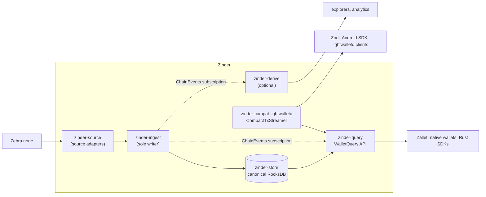

# Zinder

Zinder is a service-oriented Zcash indexer. It separates the chain ingestion plane from the wallet-facing query plane so that one product can serve modern wallets, explorers, and application backends without forcing every concern into one runtime.

## Why Zinder

The Zcash ecosystem is mid-transition. `zcashd` is deprecated; [Zebra](https://github.com/ZcashFoundation/zebra) has intentionally narrowed its scope and assigns wallet, indexer, and explorer responsibilities to projects around it. [lightwalletd](https://github.com/zcash/lightwalletd) covers shielded compact blocks but has no path to absorb the wallet RPCs that used to live inside `zcashd`. The wallet-facing API surface needs a new home that targets Zebra first, scales operationally, and treats the lightwalletd vocabulary as a migration concern rather than a permanent constraint.

Zinder is that home: a service-oriented Zcash indexer built clean-slate in Rust. The v1 deployment target is a self-hosted, single-operator service backed by a configured Zebra node. It serves [Zodl](https://github.com/zodl-inc/zodl-android), formerly Zashi, and other lightwalletd-compatible clients through the compatibility adapter, while [Zallet](https://github.com/zcash/wallet) and other Rust consumers integrate through the typed client. Public multi-tenant hosting, TLS termination, authentication, rate limiting, and quota accounting are explicitly out of v1 scope.

### Approach

**A native `WalletQuery` protocol with a separate compatibility translator.** Zinder defines its own gRPC schema for wallets and applications. The lightwalletd `CompactTxStreamer` surface is served by a discrete adapter (`zinder-compat-lightwalletd`) that translates legacy calls onto the native query API. New wallet capabilities land in `WalletQuery`; the compat layer exists so existing wallets are not stranded during migration, not as the strategic destination.

**A service-oriented split with one writer.** `zinder-ingest` is the only process that writes to canonical storage. `zinder-query` reads through an epoch-bounded read API. The compat shim translates without touching storage or upstream nodes. Reads pin to one chain epoch, so a sync batch never mixes data across competing tips. Ingestion and query scale independently.

**Upstream-node coupling isolated to one crate.** All Zebra node integration lives in `zinder-source`. Domain types, storage, and protocol crates never import Zebra or source-specific types. A new source backend is a new module in `zinder-source` rather than a workspace-wide refactor.

**Separate product, shared ecosystem lessons.** Zinder reuses no Zaino code. It uses Zaino's public tracker and architecture discussions as prior art for a different product shape: an epoch-consistent data plane for multiple consumers with explicit ingestion, query, compatibility, and derived-index boundaries.

### What to expect

**For wallet developers.** A stable native gRPC API designed not to churn with Zebra releases, plus drop-in `CompactTxStreamer` compatibility for existing clients. The wallet surface starts with compact blocks, tree state, subtree roots, transaction lookup, typed broadcast, and chain events served from a single chain epoch. Mempool views and transparent-address artifacts are planned native families with their own capability strings, not hidden extensions to the read-sync API.

**For operators.** Explicit `/healthz`, `/readyz`, and `/metrics` endpoints with typed readiness causes (`syncing`, `node_unavailable`, `reorg_window_exceeded`, and others), so load balancers and incident response act on machine-readable state. Network-aware defaults for mainnet, testnet, and regtest. Production configuration that refuses to start with placeholder credentials, unsafe binds, or missing storage. Capability detection at source connection time instead of hard version pins.

**For explorer and application backends.** Epoch-consistent reads through a typed query API. Replayable downstream derived indexes (`zinder-derive`) that consume canonical artifacts and can be rebuilt without affecting wallet sync. Additive artifact families that land as new column families without central enum edits.

**For Rust consumers.** A typed client crate (`zinder-client`) exposing `ChainIndex`, with two implementations selected by deployment topology: `LocalChainIndex` for colocated consumers (RocksDB-secondary reads, no tonic round-trip) and `RemoteChainIndex` for cross-host consumers (gRPC). Zallet and future Rust integrations consume the same trait.

### Upstream context

- [Zebra](https://github.com/ZcashFoundation/zebra): the ZFND Zcash node and Zinder's primary upstream node source.
- [Zodl](https://github.com/zodl-inc/zodl-android), formerly Zashi: a mobile wallet served through Zinder's lightwalletd-compatible adapter and validated with real wallet flows.
- [Zallet](https://github.com/zcash/wallet): the full-node wallet that should integrate through Zinder's native typed Rust client, not through lightwalletd.
- [lightwalletd](https://github.com/zcash/lightwalletd): the existing `CompactTxStreamer` protocol Zinder implements as a compatibility surface.
- [Zaino](https://github.com/zingolabs/zaino): ecosystem prior art and compatibility reference, not a Zinder dependency.

### Further reading

- [Product requirements](docs/prd-0001-zinder-indexer.md): user stories, scope, non-goals.
- [RFC-0001: Service-Oriented Indexer Architecture](docs/rfcs/0001-service-oriented-indexer-architecture.md): the boundary contract Zinder is built against.
- [Lessons from Zaino](docs/reference/lessons-from-zaino.md): prior-art lessons from Zaino's public tracker and how they inform Zinder's product guarantees.
- [Serving Zebra and Zallet](docs/reference/serving-zebra-and-zallet.md): how Zinder fits between the upstream node and the full-node wallet.
- [Architecture index](docs/README.md): full ADR and architecture doc index.

## Architecture at a glance

Zinder is one product split into independently scalable planes. One process writes canonical chain state; every other plane reads from it through a typed contract. The boundary rule is enforced by review, not by code: ingest is the only writer, and reads pin to a single `ChainEpoch` so a sync batch never mixes data across competing tips.



### Planes

- **Node source boundary** (`zinder-source`). All Zebra node coupling is isolated here. Adapters normalize upstream node observations into `NodeSource` values; no other crate imports Zebra or source-specific types, so a new source backend is a new module here rather than a workspace-wide refactor. See [node source boundary](docs/architecture/node-source-boundary.md).
- **Chain ingestion plane** (`zinder-ingest`). The only writer to canonical storage. Owns backfill, tip following, reorg handling, artifact builders, and the atomic chain-epoch commit (`commit_ingest_batch`) that makes a new epoch visible. See [chain ingestion](docs/architecture/chain-ingestion.md) and [chain events](docs/architecture/chain-events.md).
- **Canonical storage** (`zinder-store`). RocksDB-backed `PrimaryChainStore` and `SecondaryChainStore` role handles exposed to services through the domain-shaped `ChainEpochReadApi`. RocksDB types are private; the public read API is epoch-bound, so callers always resolve one `ChainEpoch` before reading any artifact. See [storage backend](docs/architecture/storage-backend.md), [ADR-0003](docs/adrs/0003-canonical-storage-access-boundary.md), and [ADR-0007](docs/adrs/0007-multi-process-storage-access.md).
- **Wallet data plane** (`zinder-query`). Read-only wallet and application API over `WalletQueryApi`, served as the native `WalletQuery` gRPC service. Owns compact block ranges, tree state, subtree roots, transaction lookup, transaction broadcast, and the public `ChainEvents` proxy. Mempool views are a planned M3 family. Never calls upstream nodes, never writes storage, never custodies keys. See [wallet data plane](docs/architecture/wallet-data-plane.md).
- **Compatibility plane** (`zinder-compat-lightwalletd`). Translates the vendored lightwalletd `CompactTxStreamer` calls onto `WalletQueryApi`. A pure translation layer: it has no source client, no canonical storage handle, and no parallel artifact construction. New compatibility adapters must use the same shape. See [protocol boundary](docs/architecture/protocol-boundary.md).
- **Derive plane** (`zinder-derive`, optional). Replayable materialized views (explorer indexes, analytics aggregates, compliance projections) that consume canonical artifacts and the `ChainEvents` stream. Cannot affect canonical state; any derived view can be discarded and rebuilt from canonical artifacts, which is the test for whether a feature belongs here versus in canonical storage. See [derive plane](docs/architecture/derive-plane.md).

Two foundation crates are shared across every plane: `zinder-core` (chain vocabulary: `ChainEpoch`, `BlockArtifact`, `Network`) and `zinder-proto` (`.proto` files and generated wire modules, including the pinned vendored lightwalletd schemas). Every binary also exposes an operational HTTP surface (`/healthz`, `/readyz`, `/metrics`) with typed readiness causes; that contract is owned by `zinder-runtime`. See [service operations](docs/architecture/service-operations.md).

For the full boundary contract, read [RFC-0001](docs/rfcs/0001-service-oriented-indexer-architecture.md) and [service boundaries](docs/architecture/service-boundaries.md).

## Workspace

Domain crates under `crates/` define stable contracts with no service runtime:

- `zinder-core`: chain vocabulary (`ChainEpoch`, `BlockArtifact`, `CompactBlockArtifact`, `Network`).
- `zinder-store`: RocksDB-backed canonical storage. Owns `PrimaryChainStore`, `SecondaryChainStore`, `ChainEpochReader`, `ChainEpochReadApi`, `ChainEvent`, `StreamCursorTokenV1`. RocksDB types are private; the public API is domain-shaped.
- `zinder-source`: upstream source adapters. Owns `NodeSource`, `NodeAuth`, `NodeCapabilities`, `ZebraJsonRpcSource`, `TransactionBroadcaster`.
- `zinder-proto`: protocol ownership. Owns `.proto` files and tonic-generated modules under `v1::wallet`, private `v1::ingest`, and vendored `compat::lightwalletd`.

Deployable services under `services/`:

- `zinder-ingest`: the only writer to canonical RocksDB. Owns backfill, tip-follow, backup checkpoints, artifact builders, the private writer-status endpoint, and the upstream-source config CLI.
- `zinder-query`: read-only wallet and application API over `ChainEpochReadApi`. Provides `WalletQueryApi` (Rust) and `WalletQueryGrpcAdapter` (tonic).
- `zinder-compat-lightwalletd`: translates the vendored lightwalletd `CompactTxStreamer` gRPC service to `WalletQueryApi`.

## Validation Gate

Run before considering any change complete:

```bash
cargo fmt --all --check
cargo check --workspace --all-targets --all-features
cargo clippy --workspace --all-targets --all-features -- -D warnings
cargo nextest run --profile=ci
cargo nextest run --profile=ci-perf
RUSTDOCFLAGS='-D warnings' cargo doc --workspace --all-features --no-deps
cargo deny check
cargo machete
git diff --check
```

`cargo nextest run` is the canonical workspace runner. Tests are tiered by directory ([ADR-0006](docs/adrs/0006-test-tiers-and-live-config.md)): T0 unit, T1 integration, T2 perf, T3 live. The `default`/`ci` profile runs T0 and T1; `ci-perf` runs T2; `ci-live` runs T3. `cargo test` continues to work as a libtest fallback (and is what `cargo mutants` shells), but is not the documented gate.

Heavier probes for trust-sensitive storage or parser changes:

```bash
cargo llvm-cov --workspace --all-features --no-report
cargo mutants --workspace --all-features \
  --file crates/zinder-store/src/chain_store.rs \
  --file crates/zinder-store/src/chain_store/validation.rs \
  --file crates/zinder-source/src/source_block.rs \
  --re 'chain_event_history|finalized_only_commit_without_artifacts|validate_reorg_window_change|from_raw_block_bytes'
```

T3 live tests use the same env-var schema as production binaries and are double-gated by `#[ignore = LIVE_TEST_IGNORE_REASON]` plus a runtime `require_live()` check. Mainnet is rejected unless tests opt in by name. To run T3 against a local Zebra:

```bash
ZINDER_TEST_LIVE=1 \
  ZINDER_NETWORK=zcash-regtest \
  ZINDER_NODE__JSON_RPC_ADDR=http://127.0.0.1:39232 \
  ZINDER_NODE__AUTH__METHOD=basic \
  ZINDER_NODE__AUTH__USERNAME=zebra \
  ZINDER_NODE__AUTH__PASSWORD=zebra \
  cargo nextest run --profile=ci-live --run-ignored=all
```

For testnet, swap `ZINDER_NETWORK=zcash-testnet` and use Zebra cookie auth (the cookie file's `user:pass` split feeds `ZINDER_NODE__AUTH__USERNAME` and `ZINDER_NODE__AUTH__PASSWORD`). Mainnet runs are `workflow_dispatch`-only until [ADR-0012 §Open mainnet infrastructure questions](docs/adrs/0006-test-tiers-and-live-config.md#open-mainnet-infrastructure-questions-parked) resolve.

## Local Observability Smoke

Use the local observability smoke when a change needs visible runtime evidence
rather than only test output:

```bash
scripts/observability-smoke.sh run
```

It starts Prometheus and Grafana, runs the Zinder host binaries against the
selected local node source, verifies checkpoint backup restore, generates native
and lightwalletd-compatible gRPC traffic, prints the scraped metric samples, and
writes readiness reports under `.tmp/observability/reports`. See
[observability/README.md](observability/README.md) for public-network commands,
calibration runs, ports, tunables, and the stop command.
