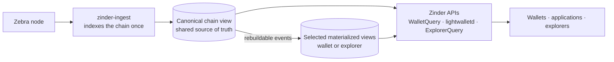

# Zinder

Zinder is a self-hosted Zcash chain-data service. It indexes the chain once from a [Zebra](https://github.com/ZcashFoundation/zebra) full node, then exposes one durable, consistent, versioned view that multiple wallets and products can share. Every read pins to one chain epoch, so a sync batch never combines data from competing tips, while shielded scanning and keys remain in the wallet.

The release runtime serves wallets that speak [lightwalletd](https://github.com/zcash/lightwalletd) through the `CompactTxStreamer` compatibility service. Zinder's native `WalletQuery` traits and typed Rust client are library contracts for custom adapters and embedded compositions; the release workflow does not publish a standalone native-query service. For lightwalletd clients, adopting Zinder can be an endpoint change rather than a wallet rewrite, although every named wallet and release still requires end-to-end certification before Zinder claims support.

## Wallet integration paths

- **Existing lightwalletd clients** keep their `CompactTxStreamer` integration and point it at `zinder-compat-lightwalletd`. ZODL and Vizor use this protocol shape, although each current wallet release still needs end-to-end validation before Zinder claims support.
- **Native wallet adapters** can implement the `WalletQuery` Rust contract when they need epoch-pinned full blocks, transaction status, chain events, mempool state, or typed broadcast results. Deploying such an adapter is a custom composition.
- **Rust wallet libraries and applications** can use `zinder-client`. `RemoteChainIndex` targets a separately composed native endpoint, while `LocalChainIndex` is limited to colocated stored reads.
- **Explorers and application backends** use epoch-consistent wallet reads plus the optional `ExplorerQuery` plane for block summaries, transaction details, mempool views, typed search, and rebuildable materialized views.

Zinder is strongest when chain access should survive one wallet process, serve several independent consumers, or remain decoupled from a particular wallet implementation. An embedded indexer such as Zaino can be simpler for one tightly coupled wallet process, while direct Zebra RPC may be sufficient when a consumer only needs node-owned data. See [What Zinder is and is not](docs/architecture/indexer-wallet-boundary.md) for the detailed comparison.

The deployment target is single-operator self-hosting backed by one Zebra node. Public endpoints sit behind operator-controlled TLS termination, authentication, rate limiting, and quota accounting.

## Quickstart

The supported wallet-serving topology uses three independent release runtimes
on one host filesystem: `zinder-ingest` owns canonical facts,
`zinder-projector` owns the wallet projection, and
`zinder-compat-lightwalletd` serves one immutable exact-fence pair. Query,
explorer, and mixed single-container images are not built or published by the
release workflow.

Bring up a Zebra node through the [Z3 platform stack](https://github.com/ZcashFoundation/z3),
then start Zinder from this checkout:

```bash
# In the Z3 checkout.
Z3_NETWORK=testnet docker compose up -d

# In the Zinder checkout.
docker compose --env-file deploy/.env.testnet \
  -f deploy/docker-compose.yml up -d --build
```

The checked-in network files provide stable, non-secret projector lease
identities for one lane per network. Override
`ZINDER_PROJECTOR_BUILD_OWNER_HEX` with another 32-character hexadecimal
value before starting a side-by-side rebuild lane.

The writer becomes ready only after canonical catch-up and a complete mempool
snapshot. The projector remains unready until it has built or resumed a
schema-v1 wallet store and reached the writer's authenticated event fence. The
compatibility service becomes ready only after its canonical and wallet
secondaries converge to one exact fence.

```bash
# Testnet ports use the +10000 network offset.
curl -fsS http://127.0.0.1:19105/readyz   # ingest
curl -fsS http://127.0.0.1:19110/readyz   # projector
curl -fsS http://127.0.0.1:19107/readyz   # compatibility reader

grpcurl -plaintext -d '{}' 127.0.0.1:19067 \
  cash.z.wallet.sdk.rpc.CompactTxStreamer/GetLightdInfo
```

The compatibility port binds to host loopback. Terminate TLS, authentication,
rate limits, and quotas in an operator-controlled proxy before exposing it.
Fresh mainnet construction still requires performance, capacity, coherent
restore, and independent-client evidence. A green local Compose deployment is
not by itself production certification. The acceptance boundaries live in the
[testing runbook](docs/runbooks/testing.md) and the recovery contract lives in
[service operations](docs/architecture/service-operations.md#recovery).

For phase behavior and recovery, see
[Initial sync](docs/runbooks/initial-sync.md). For the storage and publication
lifecycle, see
[ADR-0035](docs/adrs/0035-canonical-storage-topologies.md).

## Further reading

- [What Zinder is and is not](docs/architecture/indexer-wallet-boundary.md): the first link new integrators should follow.
- [Service boundaries](docs/architecture/service-boundaries.md): the boundary contract Zinder is built against.
- [Integration surfaces](docs/reference/integration-surfaces.md): how wallet, application, explorer, and operator clients connect to Zinder.
- [Architecture index](docs/README.md): full documentation index.

## Architecture at a glance

Zinder indexes the chain once and serves one shared chain view to wallets,
applications, and explorers. Canonical facts remain the source of truth, while
selected projections provide rebuildable views for specific query workloads.


```mermaid
flowchart LR
    Zebra["Zebra node"] --> Ingest["zinder-ingest<br/>indexes the chain once"]
    Ingest --> Canonical[("Canonical chain view<br/>shared source of truth")]
    Canonical --> APIs["Zinder APIs<br/>WalletQuery · lightwalletd · ExplorerQuery"]
    Canonical -->|"rebuildable events"| Projections[("Selected materialized views<br/>wallet or explorer")]
    Projections --> APIs
    APIs --> Consumers["Wallets · applications · explorers"]
```

The [indexer architecture](docs/architecture/canonical-projection-architecture.md) explains
how canonical indexing, projection selection, and API serving fit together.

### Planes

- **Node source boundary** (`zinder-source`). All Zebra node coupling is isolated here. Adapters normalize upstream node observations into `NodeSource` values; no other crate imports Zebra or source-specific types, so a new source backend is a new module here rather than a workspace-wide refactor. See [node source boundary](docs/architecture/node-source-boundary.md).
- **Chain ingestion plane** (`zinder-ingest`). The only writer to canonical storage. Owns fresh construction, continuous following, reorg handling, the authenticated canonical event stream, and live mempool state. See [chain ingestion](docs/architecture/chain-ingestion.md), [chain events](docs/architecture/chain-events.md), and [ADR-0015](docs/adrs/0015-unified-phase-driven-ingest.md).
- **Canonical storage** (`zinder-store`). RocksDB-backed `RocksDbCanonicalStore` and `RocksDbCanonicalSecondary` roles expose domain-shaped canonical operations. RocksDB types remain private, and readers bind to one `ChainEpoch` or `CanonicalEventFence` before reading. See [storage backend](docs/architecture/storage-backend.md) and [ADR-0003](docs/adrs/0003-canonical-storage-access-boundary.md).
- **Wallet projection plane** (`zinder-projector`, `zinder-wallet-*`). The projector is the sole wallet-store writer. It constructs and continuously follows schema-v1 wallet state at authenticated canonical event fences; the query crate remains a Rust library contract consumed by compatibility, not a standalone production runtime. See [wallet data plane](docs/architecture/wallet-data-plane.md).
- **Compatibility plane** (`zinder-compat-lightwalletd`, optional `zinder-compat-cipherscan`). Protocol-edge adapters preserve consumer contracts without shaping Zinder's native APIs around a product. The lightwalletd adapter translates `CompactTxStreamer` onto `WalletQueryApi`; the Cipherscan adapter translates REST and WebSocket contracts onto `ExplorerQuery` and `WalletQuery`. Neither owns canonical writes or parallel artifact construction. See [protocol boundary](docs/architecture/protocol-boundary.md) and the [Cipherscan adapter README](services/zinder-compat-cipherscan/README.md).
- **Explorer plane** (`zinder-explorer`, optional). Serves block summaries, transaction details, typed search, mempool dashboards, and other explorer-shaped reads through `ExplorerQuery`. Owns materialized views (consuming canonical artifacts and the `ChainEvents` stream) that cannot affect canonical state; any derived view can be discarded and rebuilt from canonical artifacts. See [explorer plane](docs/architecture/explorer-plane.md) and [materialized-view plane](docs/architecture/materialized-view-plane.md) (the reusable SDK pattern this service exercises).

Two foundation crates are shared across every plane: `zinder-core` (chain vocabulary: `ChainEpoch`, `BlockArtifact`, `Network`) and `zinder-proto` (`.proto` files and generated wire modules, including the pinned vendored lightwalletd schemas). Every binary also exposes an operational HTTP surface (`/healthz`, `/readyz`, `/metrics`) with typed readiness causes; that contract is owned by `zinder-runtime`. See [service operations](docs/architecture/service-operations.md).

For the full boundary contract, read [service boundaries](docs/architecture/service-boundaries.md).

## Workspace

Domain crates under `crates/` define stable contracts with no service runtime:

- `zinder-core`: chain vocabulary (`ChainEpoch`, `BlockArtifact`, `CompactBlockArtifact`, `Network`).
- `zinder-store`: canonical storage. Owns `RocksDbCanonicalStore`, `RocksDbCanonicalSecondary`, `CanonicalEventFence`, canonical construction and follow records, plus the artifact-oriented store used by optional materialized-view components.
- `zinder-source`: upstream source adapters. Owns `NodeSource`, `NodeAuth`, `NodeCapabilities`, `ZebraJsonRpcSource`, `TransactionBroadcaster`.
- `zinder-proto`: protocol ownership. Owns `.proto` files and tonic-generated modules under `v1::wallet`, private `v1::ingest`, and vendored `compat::lightwalletd`.
- `zinder-wallet-projection` and `zinder-wallet-rocksdb`: wallet projection rules, source commitments, leases, rows, and RocksDB persistence.
- `zinder-materialized-views`: independently versioned explorer materialized-view consumers and storage.
- `zinder-rocksdb-bulk-load`: RocksDB SST construction used by bulk-load paths.

The release workflow builds these deployable services:

- `zinder-ingest`: the only writer to canonical RocksDB. Owns construction, following, retained canonical events, the private control endpoint, live mempool state, and upstream-source configuration.
- `zinder-projector`: the only writer to wallet RocksDB. Owns fixed-fence construction, continuous canonical-event following, settlement, and bounded reorg reconciliation.
- `zinder-compat-lightwalletd`: translates the vendored lightwalletd `CompactTxStreamer` gRPC service to `WalletQueryApi`.

`zinder-query` is the internal Rust library for `WalletQueryApi`, request types,
exact-fence serving pairs, and adapters. `zinder-explorer` and
`zinder-compat-cipherscan` compile as optional services but are not release
images.

## Validation Gate

Run before considering any change complete:

```bash
cargo fmt --all --check
cargo check --workspace --all-targets --all-features
cargo clippy --workspace --all-targets --all-features -- -D warnings
cargo nextest run --profile=ci
cargo nextest run --profile=ci-parity
cargo nextest run --profile=ci-perf
RUSTDOCFLAGS='-D warnings' cargo doc --workspace --all-features --no-deps
cargo deny check
cargo machete
git diff --check
```

`cargo nextest run` is the canonical workspace runner. Tests are tiered by directory as documented in the [Testing Runbook](docs/runbooks/testing.md): T0 unit, T1 integration, T2 perf, T3 live, and T4 consumer certification. The `default`/`ci` profile runs T0 and database-free T1; `ci-postgres` runs the externally backed PostgreSQL driver test; `ci-perf` runs T2; `ci-live` runs upstream-node T3; and `ci-parity` runs T4. `cargo test` continues to work as a libtest fallback (and is what `cargo mutants` shells), but is not the documented gate.

Heavier probes for trust-sensitive storage or parser changes:

```bash
cargo llvm-cov --workspace --all-features --no-report
cargo mutants --workspace --all-features \
  --file crates/zinder-store/src/chain_store.rs \
  --file crates/zinder-store/src/chain_store/validation.rs \
  --file crates/zinder-source/src/source_block.rs \
  --re 'chain_event_history|finalized_only_commit_without_artifacts|validate_reorg_window_change|from_raw_block_bytes'
```

T3 live tests use the same env-var schema as production binaries and are double-gated by `#[ignore = LIVE_TEST_IGNORE_REASON]` plus a runtime `require_live()` check. Mainnet is rejected unless tests opt in by name. To run T3 against a local Zebra:

```bash
ZINDER_TEST_LIVE=1 \
  ZINDER_NETWORK=zcash-regtest \
  ZINDER_NODE__JSON_RPC_ADDR=http://127.0.0.1:39232 \
  ZINDER_NODE__AUTH__METHOD=basic \
  ZINDER_NODE__AUTH__USERNAME=zebra \
  ZINDER_NODE__AUTH__PASSWORD=zebra \
  cargo nextest run --profile=ci-live --run-ignored=all
```

For testnet, swap `ZINDER_NETWORK=zcash-testnet` and use Zebra cookie auth (the cookie file's `user:pass` split feeds `ZINDER_NODE__AUTH__USERNAME` and `ZINDER_NODE__AUTH__PASSWORD`). Mainnet live tests require an explicit mainnet opt-in as documented in the [Testing Runbook](docs/runbooks/testing.md).

## Local Observability Smoke

Use the local observability smoke when a change needs visible runtime evidence rather than only test output:

```bash
scripts/observability-smoke.sh run
```

It starts Prometheus and Grafana, runs ingest, projector, and the lightwalletd compatibility service against the selected local node source, records that restore is blocked until coherent canonical-plus-wallet bundles exist, generates lightwalletd-compatible gRPC traffic, prints the scraped metric samples, and writes readiness reports under `.tmp/observability/reports`. See [observability/README.md](observability/README.md) for public-network commands, calibration runs, ports, tunables, and the stop command.
