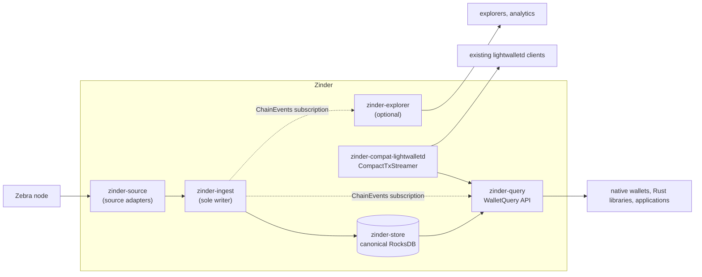

# Zinder

Zinder is a self-hosted Zcash chain-data service. It indexes the chain once from a [Zebra](https://github.com/ZcashFoundation/zebra) full node, then exposes one durable, consistent, versioned view that multiple wallets and products can share. Every read pins to one chain epoch, so a sync batch never combines data from competing tips, while shielded scanning and keys remain in the wallet.

New consumers use Zinder's native `WalletQuery` API or typed Rust client. Existing wallets that speak [lightwalletd](https://github.com/zcash/lightwalletd) use the `CompactTxStreamer` compatibility service over the same indexed data. For those clients, adopting Zinder can be an endpoint change rather than a wallet rewrite, although every named wallet and release still requires end-to-end certification before Zinder claims support.

## Wallet integration paths

- **Existing lightwalletd clients** keep their `CompactTxStreamer` integration and point it at `zinder-compat-lightwalletd`. ZODL and Vizor use this protocol shape, although each current wallet release still needs end-to-end validation before Zinder claims support.
- **Native wallet adapters** implement the `WalletQuery` protocol directly when they need epoch-pinned full blocks, transaction status, chain events, mempool state, or typed broadcast results. Zallet's existing `Chain` and `ChainView` traits provide a possible adapter seam, but Zinder `main` does not assume that adapter exists.
- **Rust wallet libraries and applications** can use `zinder-client`. Its `RemoteChainIndex` serves the full endpoint-backed surface, while `LocalChainIndex` is limited to colocated stored reads. Zally's `ChainSource` and `Submitter` traits map to the remote shape.
- **Explorers and application backends** use epoch-consistent wallet reads plus the optional `ExplorerQuery` plane for block summaries, transaction details, mempool views, typed search, and rebuildable materialized views.

Zinder is strongest when chain access should survive one wallet process, serve several independent consumers, or remain decoupled from a particular wallet implementation. An embedded indexer such as Zaino can be simpler for one tightly coupled wallet process, while direct Zebra RPC may be sufficient when a consumer only needs node-owned data. See [What Zinder is and is not](docs/architecture/indexer-wallet-boundary.md) for the detailed comparison.

The deployment target is single-operator self-hosting backed by one Zebra node. Public endpoints sit behind operator-controlled TLS termination, authentication, rate limiting, and quota accounting.

## Quickstart

Zinder reads chain data from a Zebra node managed by the [Z3 platform stack](https://github.com/ZcashFoundation/z3). Bring up Z3 first, then attach zinder. Both can run on a laptop; there is no separate Z3 instance to provision.

**Prerequisites.** Docker (or Docker Desktop) with Docker Compose v2, plus clones of this repo and [z3](https://github.com/ZcashFoundation/z3).

**1. Bring up the Z3 stack** (one-time, from your Z3 checkout):

```bash
# testnet (fast; ~10 GB chain)
git clone https://github.com/ZcashFoundation/z3.git && cd z3
Z3_NETWORK=testnet docker compose up -d

# or mainnet (~256 GB chain; expect a long initial sync)
Z3_NETWORK=mainnet docker compose up -d
```

This creates the `z3-<network>` Docker network and the `z3-<network>-cookie` volume that zinder attaches to. Zebra does not need to finish syncing first: zinder starts alongside it, reports `awaiting_upstream` until the node is ready, and proceeds on its own.

**2. Bring up zinder** (from this repo):

```bash
# testnet
docker compose --env-file deploy/.env.testnet -f deploy/docker-compose.yml up -d

# or mainnet
docker compose --env-file deploy/.env.mainnet -f deploy/docker-compose.yml up -d
```

The first `up -d` does two things in sequence:

1. **Builds** `zinder-ingest:latest`, `zinder-query:latest`, and `zinder-explorer:latest` locally from the shared `deploy/Dockerfile` builder. The first target compiles every shipped runtime binary once; later targets reuse the same BuildKit Cargo cache.
2. **Starts** `zinder-ingest`, `zinder-query`, and `zinder-explorer`. Expect the initial catch-up to take about 30 to 60 minutes on testnet and several hours on mainnet; it is done when the logs show `ingest_phase_changed` reaching `TipFollow`. Under the hood, the writer's unified ingest loop probes Zebra's tip, classifies the gap, and dispatches the right phase: `BulkCatchup` at 32-way pipelined fetches and up to 1,000 blocks per commit batch (each commit publishes a new chain epoch) on a cold store, then `TipFollow` automatically once the gap closes through the reorg window (the trailing ~100 blocks the network can still roll back). No bootstrap step, no separate one-shot service.

From another terminal:

```bash
docker logs -f zinder-ingest                              # full event log
docker logs zinder-ingest | grep ingest_phase_changed     # phase transitions
```

Subsequent `up -d` calls reuse the existing store. The loop picks up from wherever the writer left off: seconds of work in `TipFollow` after a brief restart; a return to `BulkCatchup` after a long absence until the gap closes.

For the phase model, the upstream-sync diagnostic, alternative deployment shapes (bare-metal, Kubernetes), and forked-store recovery, see [Initial sync](docs/runbooks/initial-sync.md). For the architectural relationship between Zinder and Z3 (or any future upstream platform), see [node source boundary](docs/architecture/node-source-boundary.md); observability federation across the two stacks is covered in [service operations](docs/architecture/service-operations.md).

**Observability is on by default.** Every `up -d` brings a `zinder-prometheus` container that scrapes the writer (`zinder-ingest:9105/metrics`) and the reader (`zinder-query:9106/metrics`) over a Zinder-owned Docker network. Metrics survive sync runs and restarts. Add `--profile observability` to also bring `zinder-grafana` (port 3002) with the bundled dashboards; skip the flag if you'd rather feed metrics into a sibling Grafana (Z3's, Grafana Cloud, etc.).

**3. Verify both planes.** The commands below use mainnet ports; on testnet add 10000 (`19105`, `19106`, `19101`), on regtest add 20000:

```bash
# Writer: "ready" once the loop's BulkCatchup phase has filled the store and
# the TipFollow phase has closed the last ~100 blocks of lag to Zebra's tip
curl -sS http://127.0.0.1:9105/readyz
# {"status":"ready","cause":"ready","current_height":4016431,"target_height":4016431}

# Reader: always "ready" as soon as the writer has committed anything
curl -sS http://127.0.0.1:9106/readyz
# {"status":"ready","cause":"ready","current_height":4016431,"target_height":4016431}

# Tail the writer as it follows the chain tip
docker logs -f zinder-ingest
```

Point a wallet at `localhost:9101` (native `WalletQuery` gRPC) as soon as the reader is ready; the explorer plane serves `ExplorerQuery` on `9068`. To serve existing lightwalletd wallets, run the `zinder-compat-lightwalletd` service as well; the [single-container deployment](deploy/single-container/README.md) ships it in the bundled topology.

**Multiple networks side-by-side.** Each `--env-file` produces an independently named stack (`zinder-mainnet`, `zinder-testnet`, `zinder-regtest`) with its own volumes and host ports. Mainnet uses the canonical ports above; testnet adds `+10000` (`19101`, `19106`, ...); regtest adds `+20000`. Bringing up another network is `docker compose --env-file deploy/.env.<network> -f deploy/docker-compose.yml up -d`; the existing stack keeps running.

**Beyond Docker.** See the [VM runbook](docs/runbooks/deploying-on-a-vm.md) for systemd-managed deployments, the [Railway runbook](docs/runbooks/deploying-on-railway.md) for hosted topologies, and the [single-container](deploy/single-container/README.md) image when you want one process tree instead of two containers.

## Further reading

- [What Zinder is and is not](docs/architecture/indexer-wallet-boundary.md): the first link new integrators should follow.
- [Service boundaries](docs/architecture/service-boundaries.md): the boundary contract Zinder is built against.
- [Integration surfaces](docs/reference/integration-surfaces.md): how wallet, application, explorer, and operator clients connect to Zinder.
- [Architecture index](docs/README.md): full documentation index.

## Architecture at a glance

Zinder is one product split into independently scalable planes. One process writes canonical chain state; every other plane reads from it through a typed contract. The boundary rule is enforced by review, not by code: ingest is the only writer, and reads pin to a single `ChainEpoch` so a sync batch never mixes data across competing tips.


```mermaid
flowchart LR
    Zebra["Zebra node"]

    subgraph zinder["Zinder"]
        direction TB
        Source["zinder-source<br/>(source adapters)"]
        Ingest["zinder-ingest<br/>(sole writer)"]
        Store[("zinder-store<br/>canonical RocksDB")]
        Query["zinder-query<br/>WalletQuery API"]
        Compat["zinder-compat-lightwalletd<br/>CompactTxStreamer"]
        Explorer["zinder-explorer<br/>(optional)"]

        Source --> Ingest
        Ingest --> Store
        Store --> Query
        Compat --> Query
        Ingest -. "ChainEvents subscription" .-> Query
        Ingest -. "ChainEvents subscription" .-> Explorer
    end

    Zebra --> Source
    Query --> NativeClients["native wallets, Rust libraries, applications"]
    Compat --> LightwalletdClients["existing lightwalletd clients"]
    Explorer --> Explorers["explorers, analytics"]
```

### Planes

- **Node source boundary** (`zinder-source`). All Zebra node coupling is isolated here. Adapters normalize upstream node observations into `NodeSource` values; no other crate imports Zebra or source-specific types, so a new source backend is a new module here rather than a workspace-wide refactor. See [node source boundary](docs/architecture/node-source-boundary.md).
- **Chain ingestion plane** (`zinder-ingest`). The only writer to canonical storage. Owns the unified ingest loop (bulk catch-up and tip-follow phases), reorg handling, artifact builders, and the atomic chain-epoch commit (`commit_ingest_batch`) that makes a new epoch visible. See [chain ingestion](docs/architecture/chain-ingestion.md), [chain events](docs/architecture/chain-events.md), and [ADR-0015](docs/adrs/0015-unified-phase-driven-ingest.md).
- **Canonical storage** (`zinder-store`). RocksDB-backed `PrimaryChainStore` and `SecondaryChainStore` role handles exposed to services through the domain-shaped `ChainEpochReadApi`. RocksDB types are private; the public read API is epoch-bound, so callers always resolve one `ChainEpoch` before reading any artifact. See [storage backend](docs/architecture/storage-backend.md) and [ADR-0003](docs/adrs/0003-canonical-storage-access-boundary.md).
- **Wallet data plane** (`zinder-query`). Read-only wallet and application API over `WalletQueryApi`, served as the native `WalletQuery` gRPC service. Owns compact block ranges, tree state, subtree roots, transaction lookup, transaction broadcast, the public `ChainEvents` proxy, mempool snapshots/events, and transparent-address reads. Never calls upstream nodes, never writes storage, never custodies keys. See [wallet data plane](docs/architecture/wallet-data-plane.md).
- **Compatibility plane** (`zinder-compat-lightwalletd`, `zinder-compat-cipherscan`). Protocol-edge adapters preserve consumer contracts without shaping Zinder's native APIs around a product. The lightwalletd adapter translates `CompactTxStreamer` onto `WalletQueryApi`; the Cipherscan adapter translates REST and WebSocket contracts onto `ExplorerQuery` and `WalletQuery`. Neither owns canonical writes or parallel artifact construction. See [protocol boundary](docs/architecture/protocol-boundary.md) and the [Cipherscan adapter README](services/zinder-compat-cipherscan/README.md).
- **Explorer plane** (`zinder-explorer`, optional). Serves block summaries, transaction details, typed search, mempool dashboards, and other explorer-shaped reads through `ExplorerQuery`. Owns materialized views (consuming canonical artifacts and the `ChainEvents` stream) that cannot affect canonical state; any derived view can be discarded and rebuilt from canonical artifacts. See [explorer plane](docs/architecture/explorer-plane.md) and [derive plane](docs/architecture/derive-plane.md) (the reusable SDK pattern this service exercises).

Two foundation crates are shared across every plane: `zinder-core` (chain vocabulary: `ChainEpoch`, `BlockArtifact`, `Network`) and `zinder-proto` (`.proto` files and generated wire modules, including the pinned vendored lightwalletd schemas). Every binary also exposes an operational HTTP surface (`/healthz`, `/readyz`, `/metrics`) with typed readiness causes; that contract is owned by `zinder-runtime`. See [service operations](docs/architecture/service-operations.md).

For the full boundary contract, read [service boundaries](docs/architecture/service-boundaries.md).

## Workspace

Domain crates under `crates/` define stable contracts with no service runtime:

- `zinder-core`: chain vocabulary (`ChainEpoch`, `BlockArtifact`, `CompactBlockArtifact`, `Network`).
- `zinder-store`: RocksDB-backed canonical storage. Owns `PrimaryChainStore`, `SecondaryChainStore`, `ChainEpochReader`, `ChainEpochReadApi`, `ChainEvent`, `StreamCursorTokenV1`. RocksDB types are private; the public API is domain-shaped.
- `zinder-source`: upstream source adapters. Owns `NodeSource`, `NodeAuth`, `NodeCapabilities`, `ZebraJsonRpcSource`, `TransactionBroadcaster`.
- `zinder-proto`: protocol ownership. Owns `.proto` files and tonic-generated modules under `v1::wallet`, private `v1::ingest`, and vendored `compat::lightwalletd`.

Deployable services under `services/`:

- `zinder-ingest`: the only writer to canonical RocksDB. Owns the unified ingest loop (bulk-catchup + tip-follow phases, see [ADR-0015](docs/adrs/0015-unified-phase-driven-ingest.md)), backup checkpoints, artifact builders, the private writer-status endpoint, and the upstream-source config CLI.
- `zinder-query`: read-only wallet and application API over `ChainEpochReadApi`. Provides `WalletQueryApi` (Rust) and `WalletQueryGrpcAdapter` (tonic).
- `zinder-explorer`: read-only explorer API over canonical facts and replayable derive projections. Provides the native `ExplorerQuery` gRPC service.
- `zinder-compat-lightwalletd`: translates the vendored lightwalletd `CompactTxStreamer` gRPC service to `WalletQueryApi`.
- `zinder-compat-cipherscan`: translates Cipherscan REST and WebSocket contracts to `ExplorerQuery` and `WalletQuery`.

## Validation Gate

Run before considering any change complete:

```bash
cargo fmt --all --check
cargo check --workspace --all-targets --all-features
cargo clippy --workspace --all-targets --all-features -- -D warnings
cargo nextest run --profile=ci
cargo nextest run --profile=ci-perf
RUSTDOCFLAGS='-D warnings' cargo doc --workspace --all-features --no-deps
cargo deny check
cargo machete
git diff --check
```

`cargo nextest run` is the canonical workspace runner. Tests are tiered by directory as documented in the [Testing Runbook](docs/runbooks/testing.md): T0 unit, T1 integration, T2 perf, T3 live, and consumer certification. The `default`/`ci` profile runs T0 and T1; `ci-perf` runs T2; `ci-live` runs upstream-node T3; `ci-zallet-live` provides a future-adapter harness for an externally supplied Zallet build. `cargo test` continues to work as a libtest fallback (and is what `cargo mutants` shells), but is not the documented gate.

Heavier probes for trust-sensitive storage or parser changes:

```bash
cargo llvm-cov --workspace --all-features --no-report
cargo mutants --workspace --all-features \
  --file crates/zinder-store/src/chain_store.rs \
  --file crates/zinder-store/src/chain_store/validation.rs \
  --file crates/zinder-source/src/source_block.rs \
  --re 'chain_event_history|finalized_only_commit_without_artifacts|validate_reorg_window_change|from_raw_block_bytes'
```

T3 live tests use the same env-var schema as production binaries and are double-gated by `#[ignore = LIVE_TEST_IGNORE_REASON]` plus a runtime `require_live()` check. Mainnet is rejected unless tests opt in by name. To run T3 against a local Zebra:

```bash
ZINDER_TEST_LIVE=1 \
  ZINDER_NETWORK=zcash-regtest \
  ZINDER_NODE__JSON_RPC_ADDR=http://127.0.0.1:39232 \
  ZINDER_NODE__AUTH__METHOD=basic \
  ZINDER_NODE__AUTH__USERNAME=zebra \
  ZINDER_NODE__AUTH__PASSWORD=zebra \
  cargo nextest run --profile=ci-live --run-ignored=all
```

For testnet, swap `ZINDER_NETWORK=zcash-testnet` and use Zebra cookie auth (the cookie file's `user:pass` split feeds `ZINDER_NODE__AUTH__USERNAME` and `ZINDER_NODE__AUTH__PASSWORD`). Mainnet live tests require an explicit mainnet opt-in as documented in the [Testing Runbook](docs/runbooks/testing.md).

## Local Observability Smoke

Use the local observability smoke when a change needs visible runtime evidence rather than only test output:

```bash
scripts/observability-smoke.sh run
```

It starts Prometheus and Grafana, runs the Zinder host binaries against the selected local node source, verifies checkpoint backup restore, generates native and lightwalletd-compatible gRPC traffic, prints the scraped metric samples, and writes readiness reports under `.tmp/observability/reports`. See [observability/README.md](observability/README.md) for public-network commands, calibration runs, ports, tunables, and the stop command.
