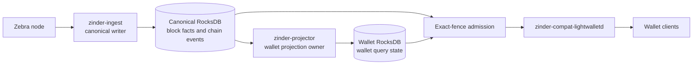

# Canonical and projection architecture

Zinder separates chain truth from consumer-shaped state. The canonical writer
persists one ordered, replayable representation of the best chain. Independent
projection owners turn that representation into wallet or explorer read models.
Serving processes admit immutable readers at an exact canonical event fence so
one request cannot combine incompatible chain and projection states.

[ADR-0035](../adrs/0035-canonical-storage-topologies.md) owns the deployment
topology decision. [Service boundaries](service-boundaries.md) owns process
responsibilities, and [Public interfaces](public-interfaces.md) owns vocabulary.

## System model

The release composition has three runtimes:

| Runtime | Durable ownership | Read ownership |
| --- | --- | --- |
| `zinder-ingest` | Canonical RocksDB and live mempool state | Zebra source observations |
| `zinder-projector` | Wallet RocksDB | Canonical RocksDB secondary and the writer control API |
| `zinder-compat-lightwalletd` | None | Immutable canonical and wallet secondary pairs |

`zinder-query` is the Rust query contract used by compatibility adapters. It is
not a release runtime. `zinder-explorer` and `zinder-compat-cipherscan` remain
optional workspace services and are not part of the release composition.

## Canonical storage

`zinder-ingest` is the only process that opens canonical storage for writes.
Its runtime uses `RocksDbCanonicalStore` with the `canonical` identity,
`CANONICAL_STORE_SCHEMA_VERSION`, the selected network, a fixed
`CanonicalReorgPolicy`, and the wallet workload. Opening a non-empty path with
different identity, version, network, workload, activation fingerprint, or
reorg policy fails without mutation.

The canonical record for each block is `CanonicalBlockFacts`. It contains the
header and ordered transaction facts required to reconstruct consumer state.
`CanonicalBlockReplay` provides the reversible storage envelope, while
`CanonicalBlockFactsDigest` and `CanonicalBlockFactsSequenceDigest` provide
backend-neutral correctness commitments. Raw block and transaction bytes are
retention-policy artifacts and are not part of the semantic digest.

Canonical storage also owns the small direct indexes and control records that
must be queried without expanding every replay envelope:

- height and hash chain position;
- optional transaction locations and retained transaction blobs;
- compact blocks, tree checkpoints, and subtree roots;
- the visible `ChainEpoch` and authenticated `CanonicalEventFence`;
- retained canonical events and displaced-block evidence;
- mempool events and canonical retention leases; and
- construction state, manifests, sequence checkpoints, and publication state.

Wallet balances, address histories, unspent-output sets, and consumer-specific
aggregates do not belong in canonical storage. This keeps canonical construction
block-local and prevents wallet-shaped historical reads from controlling writer
throughput.

## Canonical writer lifecycle

The writer has two storage modes inside one runtime.

### Construction

An empty path enters canonical construction. The writer validates connected
source segments, prepares blocks in parallel, performs ordered commitment-tree
positioning, loads the inactive store, validates its manifest and sequence
digest, then publishes one baseline epoch. Publication is the only transition
that makes the candidate readable as a canonical store.

`CanonicalConstructionSettings` bounds source segments, source requests,
reserved response bytes, block-preparation concurrency, block count, artifact
bytes, and estimated write bytes. These settings change resource admission, not
the storage contract.

### Following

After publication, `CanonicalFollower` polls the source and appends or replaces
the visible suffix. Every accepted transition atomically advances facts,
indexes, the chain epoch, and the retained canonical event stream. A replacement
deeper than the persisted `CanonicalReorgPolicy` fails closed.

The writer control API exposes authenticated event history, retention leases,
checkpoint coordination, readiness, and mempool access to trusted sibling
services. It does not expose RocksDB handles or grant another process write
ownership.

## Wallet projection

`zinder-projector` is the only wallet-store writer. It opens canonical storage
as a process-owned `RocksDbCanonicalSecondary`, converges on the writer's
authenticated fence, and binds the wallet store to
`WalletCanonicalSourceIdentity`. The identity includes the canonical schema,
network, workload, reorg policy, activation fingerprint, construction manifest,
and source sequence commitment required to prove which canonical history the
wallet rows represent.

An absent wallet store is built at a pinned canonical fence under two leases:

- `ProjectionBuildLease` prevents a competing projector generation from
  constructing or publishing the same wallet store; and
- the writer-owned canonical retention lease keeps the pinned event history
  available until continuous following takes ownership.

The builder constructs an inactive wallet store, validates its source position
and digest, catches up to the admitted fence, and publishes ready evidence.
Following then applies each retained canonical event atomically, including
bounded reorg replacement. The wallet store remains unavailable until its
persisted position and digest authenticate the same source history admitted by
the canonical reader.

## Exact-fence serving

`zinder-compat-lightwalletd` owns no primary storage. Its
`WalletServingPairPublisher` maintains independent canonical and wallet
secondary generations, catches both up, and publishes a
`WalletServingReadPair` only when all admission checks pass:

- network and reorg policy match;
- the wallet source identity matches the canonical store;
- the wallet source position names the same canonical event fence;
- both readers are immutable for the lifetime of the pair; and
- replica lag stays within the configured readiness boundary.

`WalletServingQuery` captures one published pair at request start. Its
`CanonicalReader` and `WalletProjectionReader` therefore cannot advance to
different generations during a response. Pair replacement is atomic for new
requests and does not mutate readers held by in-flight requests.

The lightwalletd adapter translates `CompactTxStreamer` requests onto this Rust
query contract. Node-backed transaction broadcast and sparse tree-state fill are
explicit edge capabilities; they never change canonical or wallet-store
ownership.

## Explorer materialized views

`zinder-materialized-views` is the reusable SDK for explorer-shaped projections.
Each `MaterializedViewConsumer` declares its stable name, owned column families,
schema version, and event application logic. The materialized-view store keeps
consumer rows, cursors, coverage, and schema metadata together so a consumer can
be rebuilt independently.

`zinder-explorer` reads canonical artifacts through a secondary and reads
materialized views through a secondary. It may federate wallet-owned facts
through `WalletQuery`; it must not duplicate wallet ownership inside the
explorer schema. The explorer and Cipherscan services are not included in the
three-runtime release composition, so their compiled APIs do not imply release
or deployment support.

See [Materialized-view plane](materialized-view-plane.md) and
[Explorer plane](explorer-plane.md) for those contracts.

## Storage topology support

`rocksdb-single-host` is the supported topology. Canonical and wallet primaries
have one owner each, readers use process-owned RocksDB secondaries, and sibling
services share a host filesystem. Containers or processes may remain separate,
but moving a primary path behind a network filesystem is outside this contract.

The PostgreSQL code in `zinder-bench` is a diagnostic implementation of the
canonical block-facts persistence benchmark. It does not implement runtime
ownership, projection storage, writer fencing, replica admission, backup,
restore, readiness, TLS, or failover. PostgreSQL is therefore not a supported
deployment topology.

## Version domains

Version numbers are local to their contract and must not be compared across
rows:

| Contract | Current code constant |
| --- | --- |
| Canonical RocksDB layout | `CANONICAL_STORE_SCHEMA_VERSION` |
| Canonical replay envelope | `CanonicalBlockReplayFormatVersion::CURRENT` |
| Canonical facts digest | `CanonicalBlockFactsDigestVersion::CURRENT` |
| Wallet RocksDB layout | `WALLET_ROCKSDB_SCHEMA_VERSION` |
| Wallet row values | `WALLET_PROJECTION_VALUE_ENCODING_VERSION` |
| Materialized-view container | `MATERIALIZED_VIEW_STORE_FORMAT_VERSION` |
| Individual materialized view | `MaterializedViewConsumerSchema::schema_version` |

Every opener validates its exact contract. Unsupported layouts are refused and
rebuilt or restored from a certified coherent bundle; readers never mutate a
store to make an incompatible version appear current.

## Extension rules

- Add source-specific behavior to `zinder-source`, not to storage or query
  crates.
- Add shared block-local truth to `CanonicalBlockFacts` only when multiple
  consumers need it and the value is reconstructible from the source block.
- Add wallet query state to `zinder-wallet-projection` and
  `zinder-wallet-rocksdb`, with projector build and follow support.
- Add explorer-only aggregates as `MaterializedViewConsumer` implementations.
- Add protocol translations at the compatibility edge without leaking protocol
  names into native storage APIs.
- Preserve exact-fence admission whenever one response combines canonical and
  projected state.
