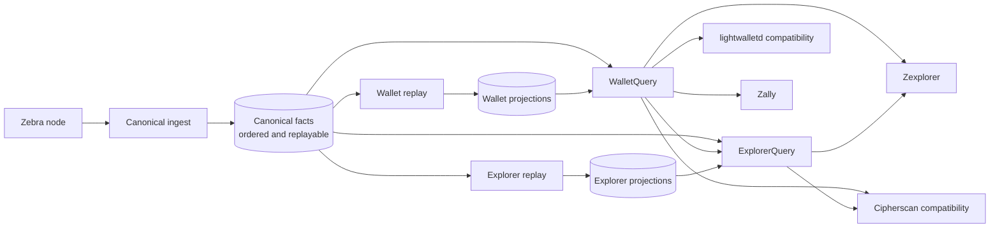

# Fact-First Indexer Architecture

Status: Accepted version-1 implementation target

Zinder will make the canonical chain available first, build the wallet serving
model second, and build optional explorer analytics last. The canonical writer
will persist immutable, block-local facts and recovery events. It will not
maintain address indexes, a global transparent-output lookup, spent-output
state, rankings, distributions, or product views while catching up.

This is an ownership correction and a measured storage design, not a new
distributed system. Canonical ingest, projection construction, and query
serving keep independent readiness and restart ownership. Canonical, wallet,
and explorer state are separate durability roles whether the
`rocksdb-single-host` topology stores them in RocksDB or the
`postgres-scale-out` topology maps them to Postgres schemas. Physical paths,
schemas, and process placement do not change the data contracts.

[ADR-0035](../adrs/0035-fact-first-storage-selection-and-lifecycle.md) owns the
topology contract. `rocksdb-single-host` is the current runtime topology;
`postgres-scale-out` remains a retained target whose block-granular diagnostic
driver consumes the same captured facts. The diagnostic driver proves a narrow
semantic round trip, not a production Postgres lifecycle, deployment, or
readiness contract. The design does not create a generic multi-backend adapter
or permit per-plane backend mixing.

The [2026-07-15 live validation](../investigations/2026-07-15-fact-first-live-validation.md)
records a fresh testnet reconstruction, full replay/header scan, and paired
RocksDB/PostgreSQL fact-store campaign. It proves fresh reconstruction,
projection convergence, restart, sampled wallet-serving behavior, and the new
fact contract across both physical drivers. It does not certify the target
fact-first runtime or the `postgres-scale-out` composition.

The [version-1 RocksDB storage construction evidence](../investigations/2026-07-15-fact-first-live-validation.md#version-1-rocksdb-storage-construction)
certifies fresh canonical and wallet storage construction through a fixed
4.175-million-block testnet tip. The baseline completed in 15 minutes 47.21
seconds; an exact-fence [readback optimization A/B](../investigations/2026-07-15-fact-first-live-validation.md#canonical-readback-optimization-ab)
reduced that to 12 minutes 43.17 seconds while preserving both semantic
digests. A subsequent density-only prefetch experiment completed in 12 minutes
10.63 seconds, but its source phase was 0.80 seconds slower. It failed the
fixed-fence source-load gate and was reverted instead of retaining unproven
scheduler complexity. The evidence proves the new bounded RocksDB construction
and cold-admission path, not live following, query serving, restore, reorg
execution, wallet-client parity, or PostgreSQL.

## Implementation Status

| Slice | Status | Evidence boundary |
| --- | --- | --- |
| `CanonicalBlockFacts`, deterministic digest, and replay envelope | Landed | Complete block-local semantic facts round-trip through clean version-1 contracts |
| Atomic RocksDB replay persistence | Landed | Replay is committed with the canonical epoch and survives reopen, secondary reads, and corruption checks |
| Full replay/header verifier | Landed and live-tested | All 4.17 million pinned testnet rows passed replay, header, and continuity checks |
| PostgreSQL fact-store driver | Diagnostic only | Direct `tokio-postgres` driver persists and freshly reads the same captured fact stream |
| Clean physical schema identities | Landed | Canonical, wallet, and explorer contracts use identity-scoped version 1 and refuse prior layouts without migration or adoption |
| Fresh RocksDB canonical builder | Wallet construction live-certified | A new `BUILDING` path fixes its workload, activation fingerprint, source range, predecessor frontiers, and build tip. The optimized clean testnet run loaded and cold-validated 4,175,080 blocks in 7 minutes 40.57 seconds, then atomically published epoch 1, event 1, and `READY` at the fixed source fence |
| One-pass wallet canonical family load | Landed and live-tested | One parse fans into header, hash index, replay, transaction location, compact block, and transaction blobs; a release container loaded one million real testnet blocks in 95.335 seconds while remaining below 100 MiB observed memory |
| Version-1 wallet row contracts and serial oracle | Landed | 6 query-owned row families, exact durable codecs, deterministic projection evidence, and bounded reorg undo are independent of the storage engine |
| RocksDB wallet construction | Production loader landed and testnet storage-certified | A fresh identity-scoped version-1 store uses bounded external runs and ordered SST ingestion, moves from `BUILDING` through cold semantic validation to `READY`, and reproduces its exact canonical source fence after a final cold reopen. The full-tip testnet build used zero historical prevout and validation random reads |
| Shared RocksDB bulk-load mechanics | Landed | `zinder-rocksdb` owns bounded fixed-record runs, capped merge fan-in, strict ordered SST emission, and physical errors without owning a domain schema or publication lifecycle |
| Production wallet bulk loader | RocksDB landed; PostgreSQL pending | Shared fixed- and variable-record runs, capped merge fan-in, wallet outpoint reduction, six-family SST ingestion, and bounded cold validation are implemented and full-tip tested. PostgreSQL still needs its concrete `COPY`, native join, and index-build path |
| `postgres-scale-out` runtime composition | Not implemented | No production schema ownership, TLS, fencing, replica reads, failover, or readiness contract |
| Complete lifecycle certification | RocksDB storage construction passed on testnet | Fresh canonical and wallet construction passed through a fixed full testnet tip under an exact Docker resource envelope. Live following, query serving, restore, reorg, client parity, mainnet, and the PostgreSQL topology remain open |

## Decision

The architecture has three durable data planes and two protocol edges:



The data planes have distinct responsibilities:

| Data plane | Owns | Does not own |
| --- | --- | --- |
| Canonical | Chain epochs, block identity, transaction order and location, immutable transaction facts, compact blocks, tree state, subtree roots, chain and mempool events, optional raw blobs, and sequential replay rows | Global transparent-output state, address indexes, spent-output lookup, wallet balances, explorer summaries, rankings, distributions, or product data |
| Wallet projection | Unspent transparent outputs, address-to-unspent-output index, address balance, durable spent-outpoint lookup, address transactions, bounded reorg undo, and an exact canonical source position | Canonical truth, explorer analytics, source-node RPCs, or per-wallet private state |
| Explorer projection | Block and transaction summaries, recent activity, fee and value-pool series, rankings, mining and migration views, reorg history, and other rebuildable public analytics | Canonical truth, wallet-private state, Cipherscan labels and names, market prices, or source-node RPCs |

`WalletQuery` and `ExplorerQuery` remain the stable product contracts. Storage
paths, RocksDB column families, and projection scheduling are implementation
details. Compatibility services translate protocols at the edge and never open
primary stores.

## Current State and Failure Mode

The current implementation is only partly fact-first. It correctly separates
many explorer projections from canonical ingest, but the canonical writer still
owns a global `transparent_output` table, `address_output_index`,
`transparent_spend_fact`, and block-local spend repair rows. Preparing a block
therefore requires resolving historical input outpoints before the chain epoch
can commit.

That coupling creates the dominant bottleneck:

1. A source block supplies input outpoints but not the values and scripts of the
   outputs they consume.
2. Canonical preparation looks up old outputs in an ever-growing RocksDB key
   space so it can materialize wallet-shaped spend facts and address indexes.
3. Dense transparent workloads turn one sequential chain scan into thousands
   of random positive reads per second.
4. Those reads compete with canonical write, WAL, flush, and compaction I/O.
5. Increasing source concurrency, batch size, memtables, or compaction jobs can
   move the limit but cannot remove the read amplification.

The canary data separates this from source, CPU, and memory limits. During a
dense historical interval around height `1869296`, canonical throughput fell to
about `10.5` blocks per second while transparent prevout resolution averaged
about `0.73` seconds per preparation window and requested about `3,273`
store-backed outpoints per second. Canonical transparent-output prefetch reads
were active for about `0.93` seconds per wall-clock second. There were no
missing outputs, sustained memory pressure, or swap. After the dense workload,
around height `2199296`, throughput recovered to about `182.5` blocks per
second and prevout resolution fell to about `0.04` seconds without an
architectural or resource change.

The wallet-only trial reached the same conclusion from a different range. It
disabled unrelated explorer projections, kept the legacy `zinder-derive`
replay and historical work gated during bulk catchup, and still became
commit-bound with low CPU usage. The projection preset reduced future legacy
projection work, but it could not remove the transparent read model embedded
in canonical ingest.

The broad post-NU5 sandblasting workload band is approximately
`1702296..2175692`. It contains several transaction shapes, and earlier history
also contains transparent-input stress. Runtime code must not branch on these
height labels. The benchmark anchors and the distinction between consensus
epochs and workload bands are owned by
[Zcash chain workload eras](zcash-chain-workload-eras.md).

## Why Tuning Alone Is Insufficient

The accepted tuning work remains useful:

- adaptive source segments and byte-based admission avoid oversized responses;
- stale speculative fetches are cancelled only after ordered shrinking
  feedback invalidates their plan;
- canonical batches close before the next block would exceed artifact or
  estimated-write budgets;
- canonical catchup, legacy `zinder-derive` replay, and historical backfills do
  not compete in the `rocksdb-single-host` topology;
- RocksDB maintenance controls and per-column-family metrics expose flush,
  compaction, and write-stall behavior; and
- legacy `zinder-derive` startup always hands projection replay to the
  asynchronous tailer.

These controls bound work and make failures observable. They do not change the
fact that the canonical writer performs wallet projection work. Treating a
larger cache, more background jobs, a different batch size, or a second volume
as the final solution would preserve the same amplification and make capacity
the correctness boundary.

The abandoned topology rewrite is also the wrong solution. Zinder does not need
a generic database adapter, a new store service, or one deployable per consumer.
The domain has three concrete durability roles. Making those roles explicit is
smaller and easier to operate than abstracting every database operation.

## Canonical Fact Contract

Canonical ingest separates early source validation from canonical parsing.
The source adapter parses only the serialized header prefix to obtain block
identity, parent identity, and time for link validation. Parallel canonical
preparation then performs exactly one full block parse, validates the coinbase
height and source identity, derives the semantic `CanonicalBlockFacts`, and
encodes its replay envelope. Ordered positioning's only stateful computation
folds the running commitment-tree sizes; it stamps that metadata, serializes the
prepared compact block, and moves the prepared replay bytes into the commit.

`CanonicalBlockFacts` is the shared correctness seam for the concrete RocksDB
runtime and the PostgreSQL diagnostic driver. Its explicitly tagged,
versioned reference digest does not impose either engine's physical encoding.
Store schema 14 and artifact schema 19 require one replay envelope per
committed header, validate it against the redundant semantic rows, and persist
it in the same atomic RocksDB batch as the `ChainEpoch` and `ChainEvent`. The
writer still expands the value into the legacy schema, so this seam does not
certify fact-first throughput or remove the current cross-block work.

The clean runtime resets every persisted contract to version 1. The version is
paired with a domain identity, so a historical version-1 store cannot collide
with the new layout. Canonical, wallet projection, and explorer projection
paths each record their own identity and network before creating data families.
A non-empty path with missing or different identity or version is refused
without mutation. There is no migration, adoption, compatibility decoder, or
automatic rebuild of an older format.

The target canonical hot schema is:

| Fact | Key | Purpose |
| --- | --- | --- |
| `store_control` | singleton | Canonical identity, schema version, network, version-1 network-upgrade activation fingerprint, workload, exact history predecessor and commitment-tree frontiers, fixed build tip, cursor-authentication key, build state, visible epoch, and ordered digest |
| `block_header` | `height` | Small direct-read block identity, parent, time, header fields, and size |
| `block_hash_index` | `block_hash` | Direct hash-to-height resolution without scanning or expanding replay facts |
| `block_replay` | `height` | Ordered semantic block and transaction facts needed by every projection; excludes retention-dependent raw blobs |
| `daily_value_pool_balance` | `day_start_unix_seconds` | Explorer-only highest-canonical-height value-pool winner for one UTC day |
| `transaction_location` | `transaction_id` | Direct transaction height, index, and block identity without expanding transaction facts |
| `compact_block` | `height` | Encoded shielded wallet-scan payload |
| `tree_state_checkpoint` | `height` | Typed wallet commitment-tree frontier at the history predecessor, at most every 100 blocks, and at the fixed build tip |
| `block_final_note_commitment_roots` | `height` | Explorer-only final Sapling, Orchard, and Ironwood roots for every retained root-bearing block |
| `subtree_root` | `(shielded_protocol, subtree_index)` | Completed wallet subtree root |
| `chain_epoch` | `chain_epoch_id` | Durable visibility snapshot retained independently of event pruning |
| `chain_event` | `event_sequence` | Durable commit or reorg transition and replay cursor source |
| `mempool_event` | `event_sequence` | Durable live-mempool transition |
| `displaced_block_facts` | `(event_sequence, height, block_hash)` | Immutable source facts required to rebuild explorer reorg history after the old branch disappears |
| `block_blob` | `height` | Compressed consensus block bytes for the `explorer` workload's raw-block capability |
| `transaction_blob` | `(height, transaction_index)` | Source-ordered raw transaction bytes; `transaction_location` resolves a transaction ID to this position in 2 point reads |

The store already has immutable network and node-discovered activation-table
identities, so version-1 physical keys do not repeat either value. The
activation fingerprint fixes the consensus interpretation used to parse every
retained transaction and is checked against the construction configuration
before source work starts. `block_replay` replaces normalized transaction
facts, intrinsic-balance rows, block transaction indexes, transparent output
indexes, spend facts, and their repair and retention state. Address state and
analytics are projections. Raw rows are written only for the selected workload
and its explicitly advertised capabilities.

Fresh construction has a separate lifecycle type from serving. A
`RocksDbCanonicalBuilder` owns only a new `BUILDING` path; it cannot reopen or
repair an existing path. `RocksDbCanonicalStore` admits only a fully validated
`READY` path. Before any data family is created, `store_control` fixes the
network-upgrade activation fingerprint, history predecessor, the exact Sapling,
Orchard, and Ironwood predecessor frontiers, the first retained height, and the
exact build-tip block identity. Complete-history builds persist the height-zero
block hash with all frontiers absent. Checkpointed builds persist the selected
checkpoint and its validated node-observed canonical `finalRoot` and
`finalState` values. Construction derives the three tree sizes from those
frontiers once before the block hot path. This anchors the retained chain,
seeds compact-block positioning without reprocessing prior history, and
prevents source exhaustion from turning a contiguous prefix into an apparently
complete build.

Canonical block construction accepts a fallible ordered source stream. It
validates each prepared block while fanning its owned values into the
workload's direct and reverse-index families. Height- and position-ordered
families rotate bounded SST files directly; the two random-key indexes use
bounded fixed-record sort runs with a capped merge fan-in, so raw transaction
and block payloads never enter the sort. The RocksDB-specific run and SST
mechanics live in `zinder-rocksdb`; canonical key codecs, family assignment,
ingestion, and readiness remain in `zinder-store`. Every family is staged
before RocksDB ingestion begins, and the store remains `BUILDING` throughout,
so a partial ingestion is never servable.

The block and subtree loaders perform immediate readback but cannot publish the
store. Publication first requires source-authenticated block families, exact
subtree-root ranges, and a final fixed-tip commitment-tree checkpoint. It then
flushes every column family, synchronizes the WAL, records the RocksDB database
identity, destroys the builder and its caches, and admits the same database
through a new `ExistingPrimary` open. The cold reader decodes every replay row,
rechecks per-family row counts and logical bytes, validates commitment-tree and
subtree-root sequences, and compares the source checkpoint again. A mismatch
leaves the path `BUILDING` and requires deletion of the entire build.

Only the resulting validation type can publish the baseline. It accepts an
explicit settled block rather than treating the visible tip as final, verifies
that block against the cold canonical header family, and writes exactly three
records in one WAL-backed synchronous batch: chain epoch 1, committed event 1,
and the `READY` control record. While epoch 1 is visible, serving admission
requires those three records and the retained canonical families to agree.
The current implementation admits only this baseline state. It rejects any
later epoch or visible tip until one atomic live-commit API can update every
required family, displaced reorg facts, epoch, event, and `READY` together.
This fail-closed boundary prevents a partial raw database mutation from being
mistaken for a valid live transition. Version-1 event bytes already encode
reverted-range presence explicitly and preserve anchored empty committed
ranges, but the codec alone does not claim live-tail support. Child-process
crash tests prove that flush, close, cold-validation, and pre-write crashes
remain `BUILDING` with no epoch/event rows, while a crash immediately after the
synced batch reopens with all three publication records. Version 1 does not
define resume, adoption, repair, migration, or a replay-only construction
route; exhaustive raw-payload scrubbing remains a background integrity
operation rather than another sync-time pass.

The release-mode Docker tracer measured the same Wallet construction path
against a local Zebra testnet node on 2026-07-15. The elapsed load includes SST
construction, ingestion, and the full cache-bypassing replay proof; the total
test also includes the independent acceptance readback. These checkpointed
ranges establish the fast construction shape but do not predict a full mainnet
build across older, denser eras.

| Retained range | Transactions | Logical rows | SST bytes | Load time | Load rate | Post-reopen proof | Total acceptance time |
| ---: | ---: | ---: | ---: | ---: | ---: | ---: | ---: |
| 1,000 blocks | 1,141 | 4.06 MB | 3.70 MB | 0.296 s | 3,378 blocks/s | 0.044 s | 0.34 s |
| 100,000 blocks | 118,034 | 595.32 MB | 557.98 MB | 15.068 s | 6,636 blocks/s | 0.010 s | 15.10 s |
| 1,000,000 blocks | 1,064,836 | 3.90 GB | 3.62 GB | 97.584 s | 10,247 blocks/s | 0.025 s | 97.63 s |

The million-block process remained near 97 MiB of observed resident memory. An
initial diagnostic harness took 341.87 seconds because it reread every large
payload family and replay twice. The optimized 97.63-second result uses exact
live-file entry metadata and checksum-verified boundary samples instead;
exhaustive payload scrubbing is outside the sync-time acceptance path.

The no-data-loss rule is strict: data may move out of canonical only after the
version-1 replay contract can reproduce it. The current semantic aggregate does
not contain Sapling, Orchard, and Ironwood compact scan payloads, all tree-size
metadata, or the contents of a displaced branch. Therefore compact blocks,
typed tree-state checkpoints, wallet subtree roots, explorer-only final roots,
and displaced-block facts remain canonical source data in version 1. Removing
them before expanding and validating replay would silently make wallet or
explorer reconstruction incomplete.

Family completeness follows the consumer contract rather than a misleading
all-height row count. Wallet construction retains the history-predecessor
frontiers, checkpoints no more than 100 blocks apart, the exact build-tip
frontiers, and continuous subtree indexes for every active pool. It omits
per-block final roots and daily value-pool balances entirely. Explorer
construction additionally retains final roots for every root-bearing canonical
height and one authoritative highest-height value-pool winner for every covered
UTC day. Initial daily winners require approximately one verbose source block
observation per day, not one per historical block.

`block_replay` is not a second truth model. It is a block-local physical
layout of the same typed facts, optimized for sequential replay. It contains no
retention-dependent block or transaction blob, address balance, spend status,
or cross-block lookup result. Parallel preparation carries raw bytes beside,
rather than inside, semantic replay until the workload-specific writer consumes
them. The `wallet` workload retains transaction blobs, while `explorer` also
retains block blobs, so retention cannot change canonical fact identity. If
benchmarks show that a structure-of-arrays representation improves decoding
and cache locality, that representation belongs inside this replay envelope or
an in-memory replay window; it does not justify another public fact model.

`CanonicalBlockFacts` is the backend-neutral Rust aggregate, not a physical
schema version. Two independently versioned contracts serve different jobs:

- `CanonicalBlockFactsDigestVersion` defines the deterministic correctness
  oracle. Version 1 commits every current field through explicit numeric tags,
  length prefixes, option-presence bytes, ordered vector boundaries, and fixed
  little-endian integers.
- `CanonicalBlockReplayFormatVersion` defines the reversible persistence
  envelope consumed by projection replay. Its first supported format is version
  1. Decoding must reconstruct the full aggregate, reject unknown or
  non-canonical bytes, and recompute the reference digest carried by the
  envelope.

The aggregate owns one block header and ordered `CanonicalTransactionFacts`;
each transaction owns its public facts, intrinsic balances, transparent inputs
and outputs, and a SHA-256 commitment to its exact serialized bytes. The block
aggregate carries the equivalent serialized-block commitment. Raw consensus
payloads are not part of the aggregate, reference digest, or replay format;
their commitments are, so store admission can bind optional retained blobs to
the semantic replay without consensus reparsing. `zinder-bench` fixture format
1 records the per-block digest contract and the ordered full-sequence digest.
Both diagnostic drivers persist replay envelopes, decode every row into
complete semantic facts, recompute the independent reference digest, and
compare the ordered evidence with the fixture oracle. Changing a fact, its
order, either versioned contract, or the semantic replay result invalidates the
candidate evidence.

This round trip is deliberately narrower than canonical storage. It does not
persist compact blocks, tree state, subtree roots, `ChainEpoch`, `ChainEvent`,
or mempool events; exercise reorg or publication recovery; or advertise query
readiness. Its result answers whether the two physical write paths preserve
the same block-local facts and how quickly they do so. It cannot satisfy the
fresh canonical construction or topology-certification gates by itself.

The version-1 encoder favors a small, auditable contract and may hold
intermediate envelope buffers while encoding. Formal resource artifacts measure
that cost across the complete candidate arm. If representative-corpus evidence
shows that preparation memory threatens the construction target, optimize the
same replay format with a consuming or streaming encoder before promoting the
diagnostic slice into a production lifecycle; do not introduce a second fact
model to hide allocation pressure.

Projection readers consume semantic replay through
`BlockReplayBatchRequest`, a forward request containing `start_height` and
a nonzero `max_blocks`. The store rejects a request above 256 blocks, returns
an empty batch when the start is beyond the pinned visible tip, and clips a
batch that crosses the tip. It resolves the batch's source epochs with one
ordered visibility-index scan, fetches the replay rows with one `multi_get`,
and fails the whole batch when any required row is missing or corrupt. Callers
advance by the returned count instead of materializing an unbounded chain
range.

Canonical ingest follows one ordered contract:

```text
source segment
  -> parse each header prefix for early link validation
  -> fully parse each block exactly once on the parallel preparation lane
  -> build semantic facts, retained raw blobs, compact artifacts, and replay bytes
  -> position only ordered commitment-tree metadata
  -> atomically commit ChainEpoch plus ChainEvent
```

The canonical commit must not read a projection database. It may resolve facts
created earlier in the same block or preparation window from memory only when
that resolution is part of parsing the immutable block envelope. Any
cross-block state transition belongs to projection replay.

Readiness follows the consumer boundary instead of one global sync state:

- `canonical-ready` means the canonical tip, replay, compact blocks, tree data,
  chain events, and configured raw-data capabilities cover the published epoch;
- `wallet-ready` means the wallet projection covers that exact epoch and can
  serve wallet and compatibility APIs; and
- `explorer-ready` means the selected analytics cover that exact epoch.

A deployment starts only the planes its consumers need. Explorer construction
never delays wallet readiness, and optional raw-data retention never delays a
deployment that does not advertise raw-data APIs. These are capability and
readiness contracts, not combinations of ad hoc storage presets.

Two closed user-facing workloads are supported. `wallet` is the fastest: it
includes canonical facts, compact blocks, tree and subtree coverage,
transaction blobs, wallet projection state, and live mempool data. `explorer`
includes the wallet workload plus explorer projections, displaced-block views,
and block blobs for raw explorer routes. Canonical-only construction is an
internal lifecycle milestone rather than a user-serving deployment. The name
`complete` is removed because it does not identify a consumer and becomes false
as soon as another product is added.

## Wallet Projection Contract

Fresh wallet construction and live following use different algorithms. The
landed RocksDB construction baseline starts only from an admitted canonical
`READY` store, fixes that store's exact epoch, tip, event sequence, and replay
sequence digest as its source fence, and creates a physically fresh wallet path
in `BUILDING`. It consumes the authenticated canonical replay stream once,
resolves created outputs and spends by an in-memory sort/merge, and writes 6
query-owned families: unspent outputs, address-ordered unspent outputs, spent
outputs, address transactions, address balances, and bounded reorg undo. The
tracer has an explicit preparation-memory ceiling and fails closed when the
fixture exceeds it. It is a correctness and lifecycle baseline for bounded
histories, not the production full-chain implementation and not evidence for a
mainnet sync-speed claim.

The production RocksDB builder preserves the same row contracts and source
fence while replacing only the preparation and load mechanics. One
authenticated replay scan emits variable-record outpoint events into bounded
external runs. A merge by outpoint produces final unspent and spent rows plus
fixed-record runs for address state, address transactions, balances, and undo;
secondary merges then create the 6 ordered SST families. RocksDB ingests those
families while the store remains `BUILDING`, flushes and closes the database,
cold-reopens it without the construction caches, validates every row family and
reconstructs index, balance, history, and undo relationships under an explicit
ceiling for accounted retained relationship key and value bytes, validates
aggregate evidence against the source fence, and only then publishes `READY`.
The differential contract suite separately compares the optimized derivation
with the serial oracle. No construction step performs a historical canonical
prevout point read, and no partial run or partially ingested family is
queryable.

Postgres implements the same construction outcome through its own physical
algorithm: binary `COPY` into unpublished version-1 tables, native SQL joins
and reductions, deferred constraint and index builds, cold validation, and one
transactional readiness publication. Cross-engine equality lives at the typed
wallet row contracts, deterministic projection digest, UTXO summary, and
serial oracle. It does not live in a generic database adapter, shared key/value
transaction, or emulation of RocksDB SST mechanics in SQL.

Live following is one ordered transparent-state machine over canonical replay
facts. For each bounded block window it:

1. resolves same-block and same-window outputs in memory;
2. performs one sorted, deduplicated set-oriented lookup for remaining inputs
   against the unspent-output set, which contains only currently unspent outputs;
   a RocksDB implementation uses `MultiGet`, while Postgres uses a set-valued
   query or temporary input relation;
3. deletes consumed unspent outputs and their address index entries;
4. inserts created unspent outputs and updates address balances;
5. appends durable spent-outpoint and address-transaction rows;
6. records the inverse delta needed for reorgs inside the supported window; and
7. commits all rows and the exact canonical source position—epoch, tip, and
   event sequence—in one storage transaction.

This changes the asymptotic storage problem. Historical input resolution no
longer searches every output ever created. It searches the smaller live UTXO
set, and each spent output leaves that hot set. A durable spend row retains the
output value, script, producing location, and spender, so historical wallet and
explorer reads do not need the deleted live row.

Pure replay preparation may run in parallel across decoded blocks. The state
transition and source-position commit remain ordered. Batches close by measured input,
output, row, and estimated-write cost rather than by a hard-coded historical
height. A single unusually dense block is allowed to form a batch by itself.

Wallet reads fail closed unless the projection source position exactly matches
the pinned canonical epoch, tip, and event sequence. A matching height alone is
insufficient because a same-height reorg can replace every relevant row.
Serving admission also validates the canonical replay sequence digest, so a
store cannot reopen against a different same-position fact stream.
Capabilities advertise only after the wallet identity and complete source
fence match. Exact point reads remain exact, while address histories and UTXO
lists use bounded, cursor-based pagination over their durable key order; no
query may materialize an unbounded result set or treat a truncated page as
complete.

## Explorer Projection Contract

Explorer replay consumes the same canonical fact stream after the wallet model
is available. Independent explorer consumers may replay in parallel when they
do not share state. Each consumer still owns an atomic cursor and coverage
fence. The explorer database can be deleted and rebuilt without affecting
canonical or wallet readiness.

Explorer transaction detail composes immutable transaction facts with the
wallet spent-output projection for transparent input values and addresses.
Block summaries, recent transactions, fee distributions, value-pool series,
rankings, mining statistics, migration views, and historical aggregates belong
to explorer projections. This keeps expensive scans and compactions out of both
canonical catchup and wallet readiness.

`BlockSummaryConsumer` keeps its schema-1 contract: `total_size_bytes` is the
complete serialized block size recorded in `BlockHeaderArtifact`. The pure
`project_block_summary_record` function can compute the existing record
directly from decoded `CanonicalBlockFacts`; unit tests and a persisted fixture
prove equivalence with the current commit-context projector. Production derive
dispatch still supplies `BlockCommitContext`, so this seam is not yet
fact-first throughput evidence.

In the target architecture, `zinder-explorer` remains a reader and API service
rather than becoming another indexer, while `zinder-ingest` remains
source-to-canonical only. An independent `zinder-projector` process will own
build, verify, catch-up, follow, and promotion for one selected projection.
`rocksdb-single-host` may colocate these processes on one host; a certified
`postgres-scale-out` composition will preserve independent role credentials
and deployment boundaries. Both contracts retain explicit readiness and
restart ownership.

## Consumer and Data Matrix

| Consumer | Canonical or live data | Wallet projection data | Explorer projection or external data |
| --- | --- | --- | --- |
| Zally native adapter | visible and safe tips, compact blocks, tree state, subtree roots, transaction status, chain events, mempool, and broadcast | transparent unspent outputs | none |
| lightwalletd compatibility | latest block, compact block ranges, transaction bytes and status, tree state, subtree roots, mempool, server info, and broadcast | transparent address transaction ids, balances, and UTXOs | none |
| Zexplorer | chain freshness, block identity, transaction facts, raw blobs when enabled, chain and mempool events | transparent balance, UTXOs, spent-output enrichment, and address activity | summaries, recent history, search indexes, fees, value pools, rankings, production, migration, reorg, and other analytics |
| Cipherscan compatibility | chain info, blocks, transactions, raw bytes when enabled, mempool, broadcast, and freshness | address detail and transparent enrichment | rankings, mining and pool analytics, privacy and cross-chain aggregates; market prices, labels, names, and product formulas remain adapter or Cipherscan-owned |

The lightwalletd and Cipherscan compatibility services are stateless protocol
edges. They translate `WalletQuery` and `ExplorerQuery`; they do not get direct
database access. Zally and Zexplorer use the same native APIs, so the storage
migration does not require consumer-specific forks.

Some capabilities are conditional. Full blocks, raw transactions, and the
Cipherscan raw routes require the corresponding raw-blob policy. A projection
that has not reached the requested fence returns an explicit unavailable or
coverage error. The system never substitutes an empty list, zero balance, or
current-height claim for missing data.

## Deployment and Scheduling

Zinder retains 2 application-level deployment topology contracts:

| Topology | Durable storage | Scaling boundary | Operational contract |
| --- | --- | --- | --- |
| `rocksdb-single-host` | RocksDB stores for canonical, wallet, and explorer state | Separate services may run on one host and share host-local storage | No Postgres dependency; exclusive primary ownership, crash-safe restart, secondary catch-up, and coherent checkpoint bundles |
| `postgres-scale-out` | One Postgres database per Zcash network with `canonical`, `wallet`, and `explorer` schemas | The canonical writer, projectors, query replicas, and database replicas deploy independently | Role-scoped credentials, durable writer fencing, failover, replica-lag reporting, and request-scoped read fences |

These are the 2 retained topology contracts, but only `rocksdb-single-host` has
a current service composition. `postgres-scale-out` names the intended scaling
boundary and may run on one host for diagnostic testing; its current
`tokio-postgres` driver does not provide production schema ownership, TLS,
writer fencing, replica reads, failover, or readiness. It becomes a supported
deployment only after its complete lifecycle and topology-specific gates pass.
The term `embedded` remains reserved for an indexer inside a consumer process,
not for Zinder's service deployment.

Once both composition roots exist, a deployment selects one topology for all 3
durable planes. Zinder will not support a hybrid matrix that independently
chooses RocksDB or Postgres per plane. That boundary retains 2 concrete,
testable operational contracts without introducing a universal database
adapter.

Fresh construction is resource-exclusive by default:

1. canonical `BulkCatchup` owns the ingest budget;
2. after canonical reaches `FollowingTip`, wallet replay drains;
3. after wallet coverage is current, wallet APIs become ready;
4. explorer deployments then drain explorer replay; and
5. low-priority historical backfills run only after their owning projection is
   current.

Bounded overlap is permitted only after measurements prove that canonical
latency and memory remain unaffected. A projection handoff may use a bounded
in-memory notification for low latency, but the durable canonical source
position is always the recovery contract. A slow or failed projection can never
backpressure or roll back a committed canonical epoch.

Inactive projection promotion remains blocked on an unimplemented lifecycle
contract. That contract requires a durable, expiring `ProjectionBuildLease`
anchored to a canonical epoch and chain event, with event pruning retaining the
anchor while the lease remains valid. The current implementation does not
persist or renew this lease, protect its anchor from pruning, or promote an
inactive generation under it, so inactive promotion has no production contract
yet.

Backups record canonical, wallet, and explorer checkpoints independently. A
restore is admitted only when each included projection proves its schema,
identity, and recovery position. Wallet state proves the exact canonical epoch,
tip, and event sequence; cursor-based projections prove their own cursor and
coverage. Missing projection checkpoints cause replay, not fabricated
readiness.

## Repository Reconciliation

The current branch set is consolidated by behavior, not by branch name:

| Disposition | Work |
| --- | --- |
| Keep | Canonical history bounds, projection-aware capabilities, replay benchmarks, engine-specific maintenance controls and metrics, adaptive source admission, bounded canonical batches, authenticated projection read fences, recovery checks, and client network validation |
| Redesign | Canonical transparent-output, address-output, and spend-fact ownership; the legacy combined `zinder-derive` database for wallet and explorer workloads; direct query assumptions that these canonical indexes are always present |
| Drop | Projection presets as a persistent storage API, the large generic storage/topology rewrite, duplicate rescue and salvage branches after their accepted commits are represented on `main`, stale detached worktrees, and height-specific incident modes |
| Reconcile separately | Portable Cipherscan operator documentation that is newer than the already-merged compatibility implementation |

No branch or worktree with uncommitted unique changes is removed before those
changes pass focused tests and are committed or explicitly rejected. The final
integration line is fast-forwarded onto `main` so the retained history stays
linear. Obsolete local branches and worktrees are deleted only after their tips
are ancestors of `main` or their rejected status is recorded here.

## Implementation Plan

### 1. Consolidate and lock contracts

- merge the accepted catchup, query-fence, recovery, benchmark, and client
  correctness work;
- retain the native `WalletQuery` and `ExplorerQuery` method contracts;
- preserve the lightwalletd and Cipherscan compatibility boundaries; and
- add benchmark fixtures for the transparent-input stress anchors, NU5
  boundary, heavy Sapling and Orchard anchors, and sandblasting end boundary.

### 2. Introduce canonical schema version 1

- promote the validated version-1 `CanonicalBlockFacts` and replay contracts
  into the concrete RocksDB canonical store;
- stop writing canonical address, unspent-output, and spent-output read models;
- remove cross-block prevout reads from canonical preparation;
- require the new `canonical` identity on a physically empty path and refuse
  every previous store without mutation or export compatibility; and
- validate the new schema from a fresh volume rather than attempting an
  in-place mainnet rewrite.

### 3. Build the wallet state machine

- give the wallet store its own fresh identity-scoped schema version 1 instead
  of renumbering or admitting legacy derive-store bytes;
- scan canonical replay once, externally sort created outputs and spends by
  outpoint, merge them without historical point reads, then sort address
  transactions and reduce balances and the UTXO commitment;
- load only final rows through RocksDB SST ingestion or PostgreSQL binary
  `COPY` followed by backend-native index construction;
- require `historical_prevout_read_count == 0` and differential equality with
  the serial wallet oracle before publication;
- retain only the bounded undo data required by the configured reorg window,
  then implement live apply and reverse-order undo as a separate algorithm;
- cut every transparent `WalletQuery` read to the wallet store, remove
  query-time catchup and canonical/derive fallbacks, and fail explicitly when
  the wallet position is not ready or trails canonical; and
- prove same-height replacement, restart recovery, cross-backend parity, and
  direct wallet query behavior before declaring the lifecycle complete.

### 4. Separate explorer projections

- move explorer-only consumers into the explorer projection database;
- compose explorer transaction and address views through the wallet contract
  instead of duplicating wallet state;
- keep each explorer consumer independently rebuildable and capability-gated;
  and
- preserve Cipherscan-owned market, label, name, and product concerns at the
  compatibility edge.

### 5. Validate the version-1 lifecycle

Acceptance is a fresh mainnet replay, not a synthetic microbenchmark alone:

- canonical catchup crosses every workload anchor without legacy projection
  execution or historical prevout state;
- canonical throughput no longer correlates with store-backed historical
  prevout requests because that metric is zero in canonical ingest;
- wallet replay crosses the transparent-input and sandblasting ranges without
  unbounded pending compaction, write stops, memory pressure, or swap;
- the wallet projection reaches tip and serves Zally plus the complete
  lightwalletd compatibility suite;
- explorer replay reaches tip and serves Zexplorer plus the covered Cipherscan
  route matrix; and
- restart, same-height reorg, backup, restore, missing-capability, and separate
  volume-path cases fail closed and recover from the wallet source position or
  the owning projection's durable cursor.

## Guardrails

- Do not add a sandblasting runtime mode or height-specific storage semantics.
- Do not introduce a generic database adapter. Compare concrete canonical and
  projection implementations through domain contracts.
- Do not let projection lag delay canonical commit.
- Do not advertise projection-backed capabilities from height alone.
- Do not let compatibility JSON or protobuf shapes become canonical tables.
- Do not duplicate wallet state in explorer projections when `WalletQuery` can
  compose the result.
- Do not parallelize the ordered wallet state transition. Parallelize parsing,
  decoding, and independent consumers around it.
- Do not make core data correctness depend on host count. Scale-out and
  failover claims require explicit multi-host acceptance evidence.

## Related Documents

- [Zcash chain workload eras](zcash-chain-workload-eras.md)
- [Legacy derive plane](derive-plane.md)
- [Wallet data plane](wallet-data-plane.md)
- [Explorer plane](explorer-plane.md)
- [Protocol boundary](protocol-boundary.md)
- [Public interfaces](public-interfaces.md)
- [ADR-0022: resource-budgeted bulk catchup](../adrs/0022-resource-budgeted-bulk-catchup.md)
- [ADR-0035: fact-first storage topologies and lifecycle targets](../adrs/0035-fact-first-storage-selection-and-lifecycle.md)
- [Integration surfaces](../reference/integration-surfaces.md)
- [Cipherscan adapter architecture](../plans/cipherscan-adapter-architecture.md)
