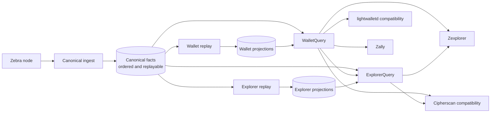

# Fact-First Indexer Architecture

Status: Accepted migration target

Zinder will make the canonical chain available first, build the wallet serving
model second, and build optional explorer analytics last. The canonical writer
will persist immutable, block-local facts and recovery events. It will not
maintain address indexes, a global transparent-output lookup, spent-output
state, rankings, distributions, or product views while catching up.

This is an ownership correction and a measured storage design, not a new
distributed system. Canonical ingest, projection construction, and query
serving keep independent readiness and restart ownership. Canonical, wallet,
and explorer state are separate durability roles whether the
`rocksdb-single-host` topology stores them in RocksDB or the
`postgres-scale-out` topology maps them to Postgres schemas. Physical paths,
schemas, and process placement do not change the data contracts.

[ADR-0035](../adrs/0035-fact-first-storage-selection-and-lifecycle.md) owns the
topology contract. `rocksdb-single-host` is the current runtime topology;
`postgres-scale-out` remains a retained target whose block-granular diagnostic
driver consumes the same captured facts. The diagnostic driver proves a narrow
semantic round trip, not a production Postgres lifecycle, deployment, or
readiness contract. The design does not create a generic multi-backend adapter
or permit per-plane backend mixing.

## Decision

The architecture has three durable data planes and two protocol edges:



The data planes have distinct responsibilities:

| Data plane | Owns | Does not own |
| --- | --- | --- |
| Canonical | Chain epochs, block identity, transaction order and location, immutable transaction facts, compact blocks, tree state, subtree roots, chain and mempool events, optional raw blobs, and sequential replay rows | Global transparent-output state, address indexes, spent-output lookup, wallet balances, explorer summaries, rankings, distributions, or product data |
| Wallet projection | Live transparent outputs, address-to-live-output index, address balance, durable spent-outpoint lookup, address transaction history, bounded reorg undo, projection cursor, and coverage fence | Canonical truth, explorer analytics, source-node RPCs, or per-wallet private state |
| Explorer projection | Block and transaction summaries, recent activity, fee and value-pool series, rankings, mining and migration views, reorg history, and other rebuildable public analytics | Canonical truth, wallet-private state, Cipherscan labels and names, market prices, or source-node RPCs |

`WalletQuery` and `ExplorerQuery` remain the stable product contracts. Storage
paths, RocksDB column families, and projection scheduling are implementation
details. Compatibility services translate protocols at the edge and never open
primary stores.

## Current State and Failure Mode

The current implementation is only partly fact-first. It correctly separates
many explorer projections from canonical ingest, but the canonical writer still
owns a global `transparent_output` table, `address_output_index`,
`transparent_spend_fact`, and block-local spend repair rows. Preparing a block
therefore requires resolving historical input outpoints before the chain epoch
can commit.

That coupling creates the dominant bottleneck:

1. A source block supplies input outpoints but not the values and scripts of the
   outputs they consume.
2. Canonical preparation looks up old outputs in an ever-growing RocksDB key
   space so it can materialize wallet-shaped spend facts and address indexes.
3. Dense transparent workloads turn one sequential chain scan into thousands
   of random positive reads per second.
4. Those reads compete with canonical write, WAL, flush, and compaction I/O.
5. Increasing source concurrency, batch size, memtables, or compaction jobs can
   move the limit but cannot remove the read amplification.

The canary data separates this from source, CPU, and memory limits. During a
dense historical interval around height `1869296`, canonical throughput fell to
about `10.5` blocks per second while transparent prevout resolution averaged
about `0.73` seconds per preparation window and requested about `3,273`
store-backed outpoints per second. Canonical transparent-output prefetch reads
were active for about `0.93` seconds per wall-clock second. There were no
missing outputs, sustained memory pressure, or swap. After the dense workload,
around height `2199296`, throughput recovered to about `182.5` blocks per
second and prevout resolution fell to about `0.04` seconds without an
architectural or resource change.

The wallet-only trial reached the same conclusion from a different range. It
disabled unrelated explorer projections, kept the legacy `zinder-derive`
replay and historical work gated during bulk catchup, and still became
commit-bound with low CPU usage. The projection preset reduced future legacy
projection work, but it could not remove the transparent read model embedded
in canonical ingest.

The broad post-NU5 sandblasting workload band is approximately
`1702296..2175692`. It contains several transaction shapes, and earlier history
also contains transparent-input stress. Runtime code must not branch on these
height labels. The benchmark anchors and the distinction between consensus
epochs and workload bands are owned by
[Zcash chain workload eras](zcash-chain-workload-eras.md).

## Why Tuning Alone Is Insufficient

The accepted tuning work remains useful:

- adaptive source segments and byte-based admission avoid oversized responses;
- stale speculative fetches are cancelled only after ordered shrinking
  feedback invalidates their plan;
- canonical batches close before the next block would exceed artifact or
  estimated-write budgets;
- canonical catchup, legacy `zinder-derive` replay, and historical backfills do
  not compete in the `rocksdb-single-host` topology;
- RocksDB maintenance controls and per-column-family metrics expose flush,
  compaction, and write-stall behavior; and
- legacy `zinder-derive` startup always hands projection replay to the
  asynchronous tailer.

These controls bound work and make failures observable. They do not change the
fact that the canonical writer performs wallet projection work. Treating a
larger cache, more background jobs, a different batch size, or a second volume
as the final solution would preserve the same amplification and make capacity
the correctness boundary.

The abandoned topology rewrite is also the wrong solution. Zinder does not need
a generic database adapter, a new store service, or one deployable per consumer.
The domain has three concrete durability roles. Making those roles explicit is
smaller and easier to operate than abstracting every database operation.

## Canonical Fact Contract

Canonical ingest separates early source validation from canonical parsing.
The source adapter parses only the serialized header prefix to obtain block
identity, parent identity, and time for link validation. Parallel canonical
preparation then performs exactly one full block parse, validates the coinbase
height and source identity, derives the semantic `CanonicalBlockFacts`, and
encodes its replay envelope. Ordered positioning's only stateful computation
folds the running commitment-tree sizes; it stamps that metadata, serializes the
prepared compact block, and moves the prepared replay bytes into the commit.

`CanonicalBlockFacts` is the shared correctness seam for the concrete RocksDB
runtime and the PostgreSQL diagnostic driver. Its explicitly tagged,
versioned reference digest does not impose either engine's physical encoding.
Store schema 14 and artifact schema 19 require one replay envelope per
committed header, validate it against the redundant semantic rows, and persist
it in the same atomic RocksDB batch as the `ChainEpoch` and `ChainEvent`. The
writer still expands the value into the legacy schema, so this seam does not
certify fact-first throughput or remove the current cross-block work.

The target hot schema is:

| Fact | Key | Purpose |
| --- | --- | --- |
| `block_header` | `(network, height)` | Block identity, parent, time, header fields, and size |
| `block_transaction_index` | `(network, height, transaction_index)` | Canonical transaction order |
| `transaction_location` | `(network, transaction_id)` | Direct transaction location |
| `transaction_facts` | `(network, transaction_id)` | Public transaction shape, input outpoints, created transparent outputs, shielded component counts, and intrinsic value data |
| `block_replay` | `(network, height)` | Compact ordered envelope of semantic block and transaction facts needed by projection replay; excludes retention-dependent raw blobs |
| `compact_block` | `(network, height)` | Encoded lightwalletd compact block |
| `tree_state` | `(network, height)` | Wallet scan checkpoint |
| `subtree_root` | `(network, pool, start_index)` | Completed subtree root |
| `chain_event` | `(network, event_sequence)` | Durable commit or reorg transition and replay cursor source |
| `mempool_event` | `(network, event_sequence)` | Durable live-mempool transition |
| `block_blob` | `(network, height)` | Optional compressed consensus block bytes |
| `transaction_blob` | `(network, transaction_id)` | Optional raw transaction bytes |

`block_replay` is not a second truth model. It is a block-local physical
layout of the same typed facts, optimized for sequential replay. It contains no
retention-dependent block or transaction blob, address balance, spend status,
or cross-block lookup result. `RetainedRawBlobs` carries optional raw block
and transaction artifacts beside, rather than inside, semantic replay, so a
deployment's raw-blob policy cannot change canonical fact identity. If
benchmarks show that a structure-of-arrays representation improves decoding
and cache locality, that representation belongs inside this replay envelope or
an in-memory replay window; it does not justify another public fact model.

`CanonicalBlockFacts` is the backend-neutral Rust aggregate, not a physical
schema version. Two independently versioned contracts serve different jobs:

- `CanonicalBlockFactsDigestVersion` defines the deterministic correctness
  oracle. Version 2 commits every current field through explicit numeric tags,
  length prefixes, option-presence bytes, ordered vector boundaries, and fixed
  little-endian integers. Numeric version 1 is intentionally unsupported
  because its pre-release contract included retention-dependent raw bytes.
- `CanonicalBlockReplayFormatVersion` defines the reversible persistence
  envelope consumed by projection replay. Decoding must reconstruct the full
  aggregate, reject unknown or non-canonical bytes, and recompute the reference
  digest carried by the envelope.

The aggregate owns one block header and ordered `CanonicalTransactionFacts`;
each transaction owns its public facts, intrinsic balances, transparent inputs
and outputs, and a SHA-256 commitment to its exact serialized bytes. The block
aggregate carries the equivalent serialized-block commitment. Raw consensus
payloads are not part of the aggregate, reference digest, or replay format;
their commitments are, so store admission can bind optional retained blobs to
the semantic replay without consensus reparsing. `zinder-bench` fixture format 4 records the
per-block digest contract and the ordered full-sequence digest. Both diagnostic
drivers persist replay envelopes, decode every row into complete semantic
facts, recompute the independent reference digest, and compare the ordered
evidence with the fixture oracle. Changing a fact, its order, either versioned
contract, or the semantic replay result invalidates the candidate evidence.

This round trip is deliberately narrower than canonical storage. It does not
persist compact blocks, tree state, subtree roots, `ChainEpoch`, `ChainEvent`,
or mempool events; exercise reorg or publication recovery; or advertise query
readiness. Its result answers whether the two physical write paths preserve
the same block-local facts and how quickly they do so. It cannot satisfy the
fresh canonical construction or topology-certification gates by itself.

The version-2 encoder favors a small, auditable contract and may hold
intermediate envelope buffers while encoding. Formal resource artifacts measure
that cost across the complete candidate arm. If representative-corpus evidence
shows that preparation memory threatens the construction target, optimize the
same replay format with a consuming or streaming encoder before promoting the
diagnostic slice into a production lifecycle; do not introduce a second fact
model to hide allocation pressure.

Projection readers consume semantic replay through
`BlockReplayBatchRequest`, a forward request containing `start_height` and
a nonzero `max_blocks`. The store rejects a request above 256 blocks, returns
an empty batch when the start is beyond the pinned visible tip, and clips a
batch that crosses the tip. It resolves the batch's source epochs with one
ordered visibility-index scan, fetches the replay rows with one `multi_get`,
and fails the whole batch when any required row is missing or corrupt. Callers
advance by the returned count instead of materializing an unbounded chain
range.

Canonical ingest follows one ordered contract:

```text
source segment
  -> parse each header prefix for early link validation
  -> fully parse each block exactly once on the parallel preparation lane
  -> build semantic facts, retained raw blobs, compact artifacts, and replay bytes
  -> position only ordered commitment-tree metadata
  -> atomically commit ChainEpoch plus ChainEvent
```

The canonical commit must not read a projection database. It may resolve facts
created earlier in the same block or preparation window from memory only when
that resolution is part of parsing the immutable block envelope. Any
cross-block state transition belongs to projection replay.

## Wallet Projection Contract

Wallet replay is one ordered transparent-state machine over canonical replay
facts. For each bounded block window it:

1. resolves same-block and same-window outputs in memory;
2. performs one sorted, deduplicated set-oriented lookup for remaining inputs
   against the live-output set, which contains only currently unspent outputs;
   a RocksDB implementation uses `MultiGet`, while Postgres uses a set-valued
   query or temporary input relation;
3. deletes consumed live outputs and their address index entries;
4. inserts created live outputs and updates address balances;
5. appends durable spent-outpoint and address-history rows;
6. records the inverse delta needed for reorgs inside the supported window; and
7. commits all rows, the authenticated chain-event cursor, the projection tip,
   and coverage in one storage transaction.

This changes the asymptotic storage problem. Historical input resolution no
longer searches every output ever created. It searches the smaller live UTXO
set, and each spent output leaves that hot set. A durable spend row retains the
output value, script, producing location, and spender, so historical wallet and
explorer reads do not need the deleted live row.

Pure replay preparation may run in parallel across decoded blocks. The state
transition and cursor commit remain ordered. Batches close by measured input,
output, row, and estimated-write cost rather than by a hard-coded historical
height. A single unusually dense block is allowed to form a batch by itself.

Wallet reads fail closed when the projection cursor does not cover the pinned
canonical epoch. A matching height alone is insufficient because a same-height
reorg can replace every relevant row. Capabilities advertise only when the
projection identity, authenticated event cursor, and required coverage match.

## Explorer Projection Contract

Explorer replay consumes the same canonical fact stream after the wallet model
is available. Independent explorer consumers may replay in parallel when they
do not share state. Each consumer still owns an atomic cursor and coverage
fence. The explorer database can be deleted and rebuilt without affecting
canonical or wallet readiness.

Explorer transaction detail composes immutable transaction facts with the
wallet spent-output projection for transparent input values and addresses.
Block summaries, recent transactions, fee distributions, value-pool series,
rankings, mining statistics, migration views, and historical aggregates belong
to explorer projections. This keeps expensive scans and compactions out of both
canonical catchup and wallet readiness.

`BlockSummaryConsumer` keeps its schema-1 contract: `total_size_bytes` is the
complete serialized block size recorded in `BlockHeaderArtifact`. The pure
`project_block_summary_record` function can compute the existing record
directly from decoded `CanonicalBlockFacts`; unit tests and a persisted fixture
prove equivalence with the current commit-context projector. Production derive
dispatch still supplies `BlockCommitContext`, so this seam is not yet
fact-first throughput evidence.

In the target architecture, `zinder-explorer` remains a reader and API service
rather than becoming another indexer, while `zinder-ingest` remains
source-to-canonical only. An independent `zinder-projector` process will own
build, verify, catch-up, follow, and promotion for one selected projection.
`rocksdb-single-host` may colocate these processes on one host; a certified
`postgres-scale-out` composition will preserve independent role credentials
and deployment boundaries. Both contracts retain explicit readiness and
restart ownership.

## Consumer and Data Matrix

| Consumer | Canonical or live data | Wallet projection data | Explorer projection or external data |
| --- | --- | --- | --- |
| Zally native adapter | visible and safe tips, compact blocks, tree state, subtree roots, transaction status, chain events, mempool, and broadcast | transparent unspent outputs | none |
| lightwalletd compatibility | latest block, compact block ranges, transaction bytes and status, tree state, subtree roots, mempool, server info, and broadcast | transparent address transaction ids, balances, and UTXOs | none |
| Zexplorer | chain freshness, block identity, transaction facts, raw blobs when enabled, chain and mempool events | transparent balance, UTXOs, spent-output enrichment, and address activity | summaries, recent history, search indexes, fees, value pools, rankings, production, migration, reorg, and other analytics |
| Cipherscan compatibility | chain info, blocks, transactions, raw bytes when enabled, mempool, broadcast, and freshness | address detail and transparent enrichment | rankings, mining and pool analytics, privacy and cross-chain aggregates; market prices, labels, names, and product formulas remain adapter or Cipherscan-owned |

The lightwalletd and Cipherscan compatibility services are stateless protocol
edges. They translate `WalletQuery` and `ExplorerQuery`; they do not get direct
database access. Zally and Zexplorer use the same native APIs, so the storage
migration does not require consumer-specific forks.

Some capabilities are conditional. Full blocks, raw transactions, and the
Cipherscan raw routes require the corresponding raw-blob policy. A projection
that has not reached the requested fence returns an explicit unavailable or
coverage error. The system never substitutes an empty list, zero balance, or
current-height claim for missing data.

## Deployment and Scheduling

Zinder retains 2 application-level deployment topology contracts:

| Topology | Durable storage | Scaling boundary | Operational contract |
| --- | --- | --- | --- |
| `rocksdb-single-host` | RocksDB stores for canonical, wallet, and explorer state | Separate services may run on one host and share host-local storage | No Postgres dependency; exclusive primary ownership, crash-safe restart, secondary catch-up, and coherent checkpoint bundles |
| `postgres-scale-out` | One Postgres database per Zcash network with `canonical`, `wallet`, and `explorer` schemas | The canonical writer, projectors, query replicas, and database replicas deploy independently | Role-scoped credentials, durable writer fencing, failover, replica-lag reporting, and request-scoped read fences |

These are the 2 retained topology contracts, but only `rocksdb-single-host` has
a current service composition. `postgres-scale-out` names the intended scaling
boundary and may run on one host for diagnostic testing; its current
`tokio-postgres` driver does not provide production schema ownership, TLS,
writer fencing, replica reads, failover, or readiness. It becomes a supported
deployment only after its complete lifecycle and topology-specific gates pass.
The term `embedded` remains reserved for an indexer inside a consumer process,
not for Zinder's service deployment.

Once both composition roots exist, a deployment selects one topology for all 3
durable planes. Zinder will not support a hybrid matrix that independently
chooses RocksDB or Postgres per plane. That boundary retains 2 concrete,
testable operational contracts without introducing a universal database
adapter.

Fresh construction is resource-exclusive by default:

1. canonical `BulkCatchup` owns the ingest budget;
2. after canonical reaches `FollowingTip`, wallet replay drains;
3. after wallet coverage is current, wallet APIs become ready;
4. complete deployments then drain explorer replay; and
5. low-priority historical backfills run only after their owning projection is
   current.

Bounded overlap is permitted only after measurements prove that canonical
latency and memory remain unaffected. A projection handoff may use a bounded
in-memory notification for low latency, but the durable chain-event cursor is
always the recovery contract. A slow or failed projection can never
backpressure or roll back a committed canonical epoch.

Inactive projection promotion remains blocked on an unimplemented lifecycle
contract. That contract requires a durable, expiring `ProjectionBuildLease`
anchored to a canonical epoch and chain event, with event pruning retaining the
anchor while the lease remains valid. The current implementation does not
persist or renew this lease, protect its anchor from pruning, or promote an
inactive generation under it, so inactive promotion has no production contract
yet.

Backups record canonical, wallet, and explorer checkpoints independently. A
restore is admitted only when each included projection proves its schema,
identity, cursor, and coverage. Missing projection checkpoints cause replay,
not fabricated readiness.

## Repository Reconciliation

The current branch set is consolidated by behavior, not by branch name:

| Disposition | Work |
| --- | --- |
| Keep | Canonical history bounds, projection-aware capabilities, replay benchmarks, engine-specific maintenance controls and metrics, adaptive source admission, bounded canonical batches, authenticated projection read fences, recovery checks, and client network validation |
| Redesign | Canonical transparent-output, address-output, and spend-fact ownership; the legacy combined `zinder-derive` database for wallet and explorer workloads; direct query assumptions that these canonical indexes are always present |
| Drop | Projection presets as a persistent storage API, the large generic storage/topology rewrite, duplicate rescue and salvage branches after their accepted commits are represented on `main`, stale detached worktrees, and height-specific incident modes |
| Reconcile separately | Portable Cipherscan operator documentation that is newer than the already-merged compatibility implementation |

No branch or worktree with uncommitted unique changes is removed before those
changes pass focused tests and are committed or explicitly rejected. The final
integration line is fast-forwarded onto `main` so the retained history stays
linear. Obsolete local branches and worktrees are deleted only after their tips
are ancestors of `main` or their rejected status is recorded here.

## Migration Plan

### 1. Consolidate and lock contracts

- merge the accepted catchup, query-fence, recovery, benchmark, and client
  correctness work;
- retain the native `WalletQuery` and `ExplorerQuery` method contracts;
- preserve the lightwalletd and Cipherscan compatibility boundaries; and
- add benchmark fixtures for the transparent-input stress anchors, NU5
  boundary, heavy Sapling and Orchard anchors, and sandblasting end boundary.

### 2. Introduce canonical schema vNext

- retain the schema-19 RocksDB tracer that persists the independently
  versioned `CanonicalBlockFacts` replay envelope atomically with each epoch;
- stop writing canonical address, live-output, and spent-output read models;
- remove cross-block prevout reads from canonical preparation;
- keep the existing canonical schema readable only for controlled export or
  rebuild tooling; and
- validate the new schema from a fresh volume rather than attempting an
  in-place mainnet rewrite.

### 3. Build the wallet state machine

- acquire and renew a durable `ProjectionBuildLease` whose anchor event is a
  hard floor for chain-event pruning until catch-up or expiry;
- create the live-output, address, spent-output, history, undo, cursor, and
  coverage tables in the wallet projection database;
- replay ordered block facts in cost-bounded batches;
- use one deduplicated lookup against the live set per replay window;
- prove same-height reorg fencing, restart recovery, and bounded rollback; and
- move transparent `WalletQuery` reads behind the projection readiness fence.

### 4. Separate explorer projections

- move complete-only consumers into the explorer projection database;
- compose explorer transaction and address views through the wallet contract
  instead of duplicating wallet state;
- keep each explorer consumer independently rebuildable and capability-gated;
  and
- preserve Cipherscan-owned market, label, name, and product concerns at the
  compatibility edge.

### 5. Validate the complete lifecycle

Acceptance is a fresh mainnet replay, not a synthetic microbenchmark alone:

- canonical catchup crosses every workload anchor with legacy `zinder-derive`
  replay and historical work closed;
- canonical throughput no longer correlates with store-backed historical
  prevout requests because that metric is zero in canonical ingest;
- wallet replay crosses the transparent-input and sandblasting ranges without
  unbounded pending compaction, write stops, memory pressure, or swap;
- the wallet projection reaches tip and serves Zally plus the complete
  lightwalletd compatibility suite;
- explorer replay reaches tip and serves Zexplorer plus the covered Cipherscan
  route matrix; and
- restart, same-height reorg, backup, restore, missing-capability, and separate
  volume-path cases fail closed and recover from durable cursors.

## Guardrails

- Do not add a sandblasting runtime mode or height-specific storage semantics.
- Do not introduce a generic database adapter. Compare concrete canonical and
  projection implementations through domain contracts.
- Do not let projection lag delay canonical commit.
- Do not advertise projection-backed capabilities from height alone.
- Do not let compatibility JSON or protobuf shapes become canonical tables.
- Do not duplicate wallet state in explorer projections when `WalletQuery` can
  compose the result.
- Do not parallelize the ordered wallet state transition. Parallelize parsing,
  decoding, and independent consumers around it.
- Do not make core data correctness depend on host count. Scale-out and
  failover claims require explicit multi-host acceptance evidence.

## Related Documents

- [Zcash chain workload eras](zcash-chain-workload-eras.md)
- [Legacy derive plane](derive-plane.md)
- [Wallet data plane](wallet-data-plane.md)
- [Explorer plane](explorer-plane.md)
- [Protocol boundary](protocol-boundary.md)
- [Public interfaces](public-interfaces.md)
- [ADR-0022: resource-budgeted bulk catchup](../adrs/0022-resource-budgeted-bulk-catchup.md)
- [ADR-0035: fact-first storage topologies and lifecycle targets](../adrs/0035-fact-first-storage-selection-and-lifecycle.md)
- [Integration surfaces](../reference/integration-surfaces.md)
- [Cipherscan adapter architecture](../plans/cipherscan-adapter-architecture.md)
