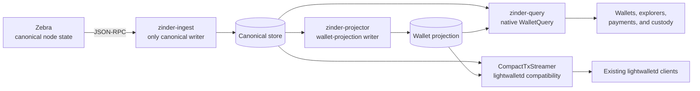

# The Indexer and Wallet Boundary

Zinder indexes the canonical chain once and exposes one durable, consistent, versioned view that multiple wallets and products can share. It serves that view through native Zinder APIs and through a lightwalletd-compatible `CompactTxStreamer` endpoint, so new and existing integrations can use the same indexed data.

This page explains where that architecture fits, what Zinder owns, and what remains inside a wallet. It is the canonical decision guide for choosing between direct node access, an embedded indexer, a shared Zinder deployment, and a lightwalletd-compatible endpoint.

## One chain view, many consumers

Every wallet needs chain data, but not every wallet should build, persist, and reconcile that data independently. Zinder moves chain access out of an individual wallet process and into a consumer-neutral service. One ingest process reads from Zebra, commits canonical artifacts, and makes them available to wallet, explorer, payment, and custody consumers.

The shared view has 3 properties:

- **Durable**: indexed artifacts survive consumer restarts and do not need to be rebuilt for each wallet process.
- **Consistent**: every chain-dependent read resolves one `ChainEpoch`, so a response does not mix artifacts from competing tips or a partially committed update.
- **Versioned**: native protocols, artifact schemas, capabilities, and chain epochs make compatibility and freshness explicit rather than implicit in a process-local implementation.

This separation becomes more valuable as consumers multiply. A full-node wallet, a mobile wallet, and an explorer need different application behavior, but they can read the same compact blocks, tree state, transactions, transparent-address artifacts, and chain events from one index.

## One index, two integration contracts

Zinder exposes the same indexed chain through 2 contracts. The native contract is designed for applications that can adopt Zinder directly; the compatibility contract preserves the protocol expected by existing lightwalletd clients.

### Native Zinder contract

`WalletQuery` and the Rust `zinder-client` expose typed errors, capability discovery, epoch-pinned reads, resumable chain events, transaction broadcast outcomes, mempool views, and transparent-address artifacts. An integration that deploys the native adapter should prefer this contract when it needs explicit consistency or Zinder-specific features.

The Rust client divides the contract by topology. `RemoteChainIndex` uses gRPC across a process or host boundary, while `LocalChainIndex` uses a colocated RocksDB secondary without a tonic round trip. Both implement `ChainIndex` for canonical and wallet-projection reads. Operations that require a live ingest-control endpoint, including broadcast and live subscriptions, use the `EndpointBackedIndex` extension and are available through `RemoteChainIndex`.

### Lightwalletd compatibility contract

`zinder-compat-lightwalletd` serves the vendored lightwalletd `CompactTxStreamer` protocol by translating requests onto `WalletQueryApi`. `WalletServingQuery` answers from an admitted pair of canonical and wallet-projection readers; it does not maintain a second index, read Explorer materialized views, use Zebra as a fallback for indexed history, or construct parallel artifacts. It may broadcast transactions, discover network-upgrade activations, and fill sparse tree state through `zinder-source` when the query contract explicitly delegates those operations upstream.

For a client that already speaks the supported `CompactTxStreamer` protocol, adopting Zinder can be an endpoint substitution rather than a wallet rewrite. This is a wire-compatibility statement, not a claim that the Zinder binaries and configuration replace a lightwalletd deployment unchanged. Operators deploy Zinder's ingest, projector, native query, and compatibility runtimes, and each named wallet requires its own end-to-end certification before the project claims tested support.

## Choose by ownership and topology

The main architectural choice is who owns the indexed chain view and how many consumers reuse it. These options are complementary rather than a quality ranking.

| Option | Chain-data owner | Strongest fit | Main tradeoff |
| --- | --- | --- | --- |
| Zebra directly | The validator | A consumer needs node RPC data and can own any indexing, consistency, and reorg logic itself | Minimal additional infrastructure, but application-specific indexing and reconciliation stay in each consumer |
| Zaino embedded | The wallet process | One wallet benefits from an in-process indexer and wants its lifecycle coupled to the wallet | Simple process-local integration, but indexed state and operational lifecycle remain tied to that consumer |
| Zinder shared service | A separate indexer deployment | Multiple processes or products need one durable chain view, or chain data must outlive any individual consumer | Adds an operated service and storage layer, while centralizing indexing, consistency, and reuse |
| Lightwalletd-compatible serving | A lightwalletd server or Zinder's compatibility service | Existing light clients already speak `CompactTxStreamer` and should keep that integration contract | Preserves the established wallet protocol, but does not expose every native Zinder capability |

Choose direct Zebra access when the node's APIs answer the complete use case and the consumer can safely own any missing state. Choose an embedded indexer when process-local simplicity matters more than cross-consumer reuse. Choose Zinder when durability, explicit consistency, independent scaling, or reuse across multiple consumers justifies a service boundary. Expose Zinder's compatibility service when existing lightwalletd clients also need to consume that shared index.

An ephemeral or wallet-private Zinder deployment is possible, but it gives up much of Zinder's advantage. If one wallet owns the indexer's lifecycle and no other consumer reuses its state, an embedded indexer may be the simpler fit.

## Chain truth and wallet truth

Zinder owns facts whose answers are the same for every caller at a given chain epoch. Wallets own facts that depend on keys, accounts, users, or local policy. This division lets several wallet shapes share chain infrastructure without forcing them to share a wallet model.

### Zinder owns consumer-neutral chain data

- Compact-block range reads.
- Sapling, Orchard, and Ironwood tree-state reads where supported by the active network upgrade.
- Shielded subtree-root reads for batched scanning.
- Transparent-address unspent outputs, transaction history, and confirmed balance.
- Canonical and live-mempool transparent prevout resolution.
- Transaction lookup and broadcast.
- Mempool snapshots and change events.
- Cursor-resumable committed and reorged chain events.
- Capability discovery and chain-view freshness metadata.

### Wallets own consumer-specific state

- Spending keys, viewing keys, and seed phrases.
- Trial decryption and shielded-output ownership.
- Accounts, wallet birthdays, sync progress, and transaction labels.
- Address books, notification settings, and fiat-conversion preferences.
- Transaction construction, proving, and signing.
- User identity, compliance policy, and per-user audit records.

This boundary also preserves shielded privacy. Zinder serves compact chain artifacts, while trial decryption stays with the consumer that holds the relevant keys.

## Operational boundary

Zinder's release topology is a single operator backed by one upstream Zebra node. `zinder-ingest` is the only canonical writer, `zinder-projector` is the only wallet-projection writer, and `zinder-query` plus `zinder-compat-lightwalletd` independently serve admitted canonical and wallet-projection secondaries. Native clients call the `WalletQuery` runtime; existing lightwalletd clients call the compatibility runtime. Readers either see the previous `ChainEpoch` or the newly committed epoch, never a half-committed batch.

Zinder does not provide tenant isolation, terminate public TLS, authenticate callers, or enforce per-client rate limits. Operators place an appropriate proxy or private network boundary in front of externally reachable services. Cross-host RocksDB secondaries are also outside the recommended topology; remote consumers should use gRPC.

## Classify a new capability

Ask 3 questions before adding a primitive to Zinder:

1. Does it require a spending key, viewing key, or seed? If yes, it belongs in the wallet.
2. Does the answer depend on which user or account is asking? If yes, it belongs in the wallet or application layer.
3. Is the answer identical for every authorized caller at the same chain epoch? If yes, it is a candidate for Zinder.

A proposed per-user table inside Zinder usually signals that wallet state has crossed the boundary. Keep consumer-specific state with the consumer and add only the shared chain primitive to Zinder.

## Related documentation

- [ADR-0003: Canonical storage access boundary](../adrs/0003-canonical-storage-access-boundary.md)
- [ADR-0005: Consumer-neutral wallet data plane](../adrs/0005-consumer-neutral-wallet-data-plane.md)
- [Wallet data plane](wallet-data-plane.md)
- [Protocol boundary](protocol-boundary.md)
- [Server-side wallet pattern](../reference/server-side-wallet-pattern.md)
- [Integration surfaces](../reference/integration-surfaces.md)
