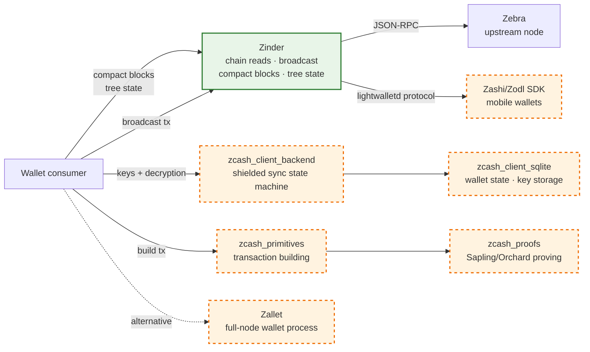

# What Zinder Is and Is Not

This page is the first link a new integrator should follow. It says, in plain language, what Zinder *does* and what it *does not*. If your integration plan assumes Zinder owns a primitive listed under "Zinder does not do this", you are looking at the wrong layer.

## In one paragraph

Zinder is a Zcash chain indexer. It reads canonical chain state from Zebra (or a future compatible source), commits typed artifacts to local storage, and serves wallet-shaped reads over gRPC. It runs as a single-operator service. It never holds keys, never decrypts shielded outputs, and never maintains per-consumer wallet state. A consumer that needs key custody, shielded scanning, or per-account state pairs Zinder with a wallet library (typically `zcash_client_backend` + `zcash_client_sqlite` from librustzcash) or with a wallet process (Zallet, Zashi, Zodl).

## Zinder does this

- **Compact-block range reads**: paginated `CompactBlock` artifacts (`WalletQuery.CompactBlockRange`).
- **Tree-state reads**: Sapling/Orchard commitment-tree state at a height (`WalletQuery.TreeState`).
- **Subtree-root reads**: shielded subtree roots for batched scanning (`WalletQuery.SubtreeRootsInRange`).
- **Transparent-address output reads**: paginated current output set per address (`WalletQuery.AddressOutputIndexStream`).
- **Transparent-address tx-history reads**: paginated tx-ids per address in a height range (`WalletQuery.TransparentAddressTxIdsInRange`).
- **Transparent-address balance**: confirmed balance from canonical outputs plus an optional derive-plane mempool overlay (`WalletQuery.TransparentAddressBalance`).
- **Mempool reads**: snapshot + change-event subscription (`WalletQuery.MempoolSnapshot`, `WalletQuery.MempoolEvents`).
- **Transparent prevout resolution**: canonical and live-mempool spend lookups.
- **Transaction broadcast**: forwards raw transactions to the upstream node.
- **Chain-event subscription**: cursor-resumable committed/reorged stream with optional address-invalidation hint ([Chain events §Address Filters](chain-events.md#address-filters)).
- **Capability discovery**: `ServerInfo` advertises which RPCs and features the deployment serves.
- **Lightwalletd compatibility**: the `zinder-compat-lightwalletd` binary speaks the vendored lightwalletd protocol so Zashi/Zodl and the Android SDK integrate without changes.

## Zinder does NOT do this

- **Hold keys.** No spending keys, viewing keys, or seed phrases ever touch the indexer. [ADR-0005](../adrs/0005-consumer-neutral-wallet-data-plane.md).
- **Scan shielded outputs per account.** Trial decryption stays in the consumer where the keys live.
- **Maintain per-consumer wallet state.** Account balances, transaction labels, address books, fiat-conversion rates, and notification settings all live in the consumer.
- **Infer address ownership.** Two clients querying the same transparent address get the same response; Zinder has no concept of "this consumer owns this address".
- **Compliance or identity.** No KYC, no source-of-funds tracking, no per-user audit logs of which addresses were queried.
- **Terminate TLS, authenticate callers, or rate-limit.** Operators put a reverse proxy in front of Zinder for any of these; these surfaces are out of v1 scope.
- **Provide multi-tenant hosting.** Zinder serves one logical operator; tenant isolation lives at the layer above.
- **Run cross-host RocksDB secondaries.** Single-host topology is the v1 recommendation. [ADR-0003](../adrs/0003-canonical-storage-access-boundary.md).

## Where to go for each "Zinder does not do this" capability

| Capability Zinder does not provide | Where it lives |
| --- | --- |
| Shielded sync state machine | [`zcash_client_backend`](https://crates.io/crates/zcash_client_backend) |
| Wallet state + key storage | [`zcash_client_sqlite`](https://crates.io/crates/zcash_client_sqlite) |
| Transaction building | [`zcash_primitives`](https://crates.io/crates/zcash_primitives) |
| Sapling/Orchard proving | [`zcash_proofs`](https://crates.io/crates/zcash_proofs) |
| Full-node wallet process (RPC-shaped) | [Zallet](https://github.com/zcash/wallet) |
| Mobile wallet integration | Zashi/Zodl, via `zinder-compat-lightwalletd` |
| TLS, auth, rate limiting | Operator-supplied reverse proxy (Caddy, Nginx, Cloudflare) |

## Why this boundary exists

Three reasons, in order of weight:

1. **Consumers do not agree on wallet shape.** A mobile wallet, an exchange backend, and a full-node desktop wallet all need different account abstractions. Zinder serves the substrate they share (chain reads + broadcast) without picking a winner.
2. **Privacy.** A wallet-facing indexer that scans shielded outputs server-side would defeat shielded privacy. Trial decryption stays where keys live, full stop.
3. **Operability.** A single operator running Zinder against one Zebra is the v1 deployment shape. Wallet-state databases, key-rotation policies, and per-user audit logs require infrastructure Zinder is not designed to own.

## When you are unsure where a primitive belongs

Ask three questions:

1. *Does it need a key?* If yes → consumer side.
2. *Does it depend on which user is asking?* If yes → consumer side.
3. *Is the answer the same for every caller given the same on-chain state?* If yes → Zinder.

If you find yourself adding a per-user table to Zinder, stop and reconsider. The right place is almost always a wallet library on the consumer side.

## References

- [ADR-0005: Consumer-neutral wallet data plane](../adrs/0005-consumer-neutral-wallet-data-plane.md)
- [Wallet data plane](wallet-data-plane.md)
- [Server-side wallet pattern](../reference/server-side-wallet-pattern.md)
- [Integration surfaces](../reference/integration-surfaces.md)
