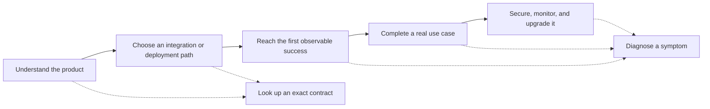

# Developer documentation strategy

Status: Proposed

Delivery platform: Fumadocs

Audience: Zinder maintainers, documentation authors, and reviewers

Decision horizon: the first public documentation portal and the next 2 to 3 Zinder release cycles

## Recommendation

Build Zinder's public documentation around the decisions a reader needs to make, not around the repository tree. Keep the current architecture documents, ADRs, investigations, plans, references, and runbooks as the engineering source of truth, but expose a smaller curated journey for evaluators, integrators, operators, and contributors.

The first public release should have 6 visible areas: Start, Integrate, Operate, Reference, Contribute, and Releases. It should reuse the strongest current pages, split the root quickstart into focused paths, add missing task guides and generated references, and keep plans and investigations out of the primary navigation.

Use Fumadocs for the first implementation. Zinder will own a small React documentation application and its deployment, search, feedback, and agent-facing integrations. Fumadocs' composable UI, custom routing, and Markdown output fit Zinder's need for architecture diagrams, capability matrices, gRPC examples, and self-hosted control. Zinder will also own the pipeline that generates protobuf, capability, configuration, and release reference material.

Do not migrate all current documents into a new site at once. First prove the navigation and page contracts with a small vertical slice: product overview, path chooser, operator quickstart, lightwalletd integration, native Rust integration, and error reference.

## Product and research scope

Zinder is a self-hosted Zcash chain-data service. It indexes one canonical chain view from Zebra and serves that view to wallets, applications, explorers, payment systems, and compatibility clients. The documentation must help readers understand both the product decision and the operational consequences of running shared chain infrastructure.

This strategy covers:

- Product evaluation and integration choices.
- Wallet, application, explorer, and operator journeys.
- Public concepts, task guides, and reference material.
- Contributor documentation that explains Zinder's internal contracts.
- Writing, microcopy, visual structure, navigation, search, versioning, and agent access.
- The Fumadocs implementation boundary and content migration strategy.

It does not redesign Zinder's product architecture, replace the current document lifecycle rules, or turn active plans and investigations into public product claims.

## Current documentation audit

The current repository has 99 Markdown documents under `docs/`, including the documentation index. The content is weighted toward engineering decisions and implementation evidence:

| Area | Files | Primary job |
| --- | ---: | --- |
| Architecture | 16 | Durable contracts, boundaries, and invariants |
| ADRs | 35 | Accepted design decisions |
| Investigations | 24 | Time-bounded evidence and analysis |
| Plans | 9 | Proposed sequencing and evidence gates |
| Product requirements | 3 | Product contracts and acceptance boundaries |
| Reference | 4 | Current integration and API support material |
| Runbooks | 7 | Operational procedures |

Architecture, ADRs, and investigations account for 75 of 98 categorized pages. Reference and runbook material accounts for 11. This distribution is appropriate for a repository that treats documentation as an engineering contract, but it does not yet form a complete external developer journey.

### Strong foundations

Zinder already has several elements that strong developer portals often lack:

- The root README states the product boundary and names the major wallet integration paths before presenting implementation detail.
- `docs/README.md` begins with a goal-based routing table instead of only listing folders.
- [The indexer and wallet boundary](../architecture/indexer-wallet-boundary.md) clearly separates shared chain truth from wallet-owned keys, accounts, and policy.
- [Integration surfaces](../reference/integration-surfaces.md) maps client shapes to native Rust, protobuf, explorer, and lightwalletd-compatible contracts.
- [The server-side wallet pattern](../reference/server-side-wallet-pattern.md) includes a compiled example and explicit error-handling guidance.
- [The error vocabulary](../reference/error-vocabulary.md) gives clients a typed retry and operator-action contract instead of asking them to parse messages.
- Runbooks contain prerequisites, commands, expected signals, recovery actions, and operational boundaries.
- Document lifecycles distinguish durable architecture from decisions, plans, investigations, reference, and procedures.

These documents should remain authoritative. The public site should add orientation and task flow around them rather than rewriting the same contracts in a second voice.

### Reader friction

The current experience creates 7 main problems:

1. **The repository is the interface.** There is no documentation application, search experience, version indicator, page metadata, feedback surface, or dedicated documentation build.
2. **The main quickstart serves several jobs.** It introduces the product, installs an operator topology, explains readiness, links integrations, describes architecture, maps the workspace, and lists contributor validation in one README.
3. **The visible index is smaller than the content set.** The index links only selected investigations, plans, and runbooks, while the repository contains many more. This is useful curation, but readers cannot tell whether an omitted page is obsolete, internal, or simply undiscoverable.
4. **Public tasks often begin inside reference material.** The integration surface is well described, but most readers still need a complete task from starting condition to verified outcome.
5. **Distribution is not yet a product surface.** Rust crates use workspace paths, and [issue 9](https://github.com/gustavovalverde/zinder/issues/9) records that non-Rust consumers cannot pin a versioned protobuf contract without copying files or vendoring the repository.
6. **Release guidance is missing.** The repository has no changelog, version policy, migration index, deprecation page, or public support matrix. Individual runbooks mention rollback and schema concerns, but readers cannot follow one release-to-upgrade path.
7. **Link integrity depends on workspace layout.** An offline link check found 12 unresolved local links. Ten point into sibling Zaino or Zexplorer checkouts, and 2 point to missing runbook pages. These links can work in one developer workspace while failing on GitHub or a documentation site.

## Reader model

Every public page should name one primary reader and one outcome. A page may support adjacent roles, but it should not alternate between them.

| Reader | Starting question | Successful outcome | Current foundation | Main gap |
| --- | --- | --- | --- | --- |
| Evaluator or technical lead | Should this product use Zinder, Zebra directly, Zaino, or lightwalletd? | Chooses a topology and can explain its ownership and operational tradeoff | Indexer and wallet boundary; integration surfaces | Short product overview, decision flow, deployment cost and maturity summary |
| Existing wallet integrator | Can an existing `CompactTxStreamer` client use Zinder? | Connects to `zinder-compat-lightwalletd` and verifies the wallet's required flows | Integration surfaces; compatibility plan; testing runbook | Endpoint-change tutorial, TLS guidance, compatibility matrix, certification status |
| Native Rust integrator | How does an application use epoch-pinned reads, events, and broadcast? | Connects `RemoteChainIndex`, performs one read, and handles typed errors | Server-side wallet pattern; crate examples | Installable version, focused quickstart, API reference, version support |
| Non-Rust gRPC integrator | How does a client generate and pin its protocol bindings? | Pins a contract artifact, generates a client, calls `ServerInfo`, and checks capabilities | Proto source; vendoring guidance | Versioned contract artifact and language-neutral generation guide |
| Explorer or application backend developer | Which facts and projections can the product query? | Selects `ExplorerQuery` and `WalletQuery` methods, checks freshness, and renders explicit privacy refusals | Chain data catalog; explorer architecture; Cipherscan adapter | Outcome-based examples, method reference, sample responses, UI error guidance |
| Operator | How do I deploy, synchronize, monitor, upgrade, and recover Zinder? | Runs the correct topology and can distinguish starting, syncing, ready, degraded, and failed states | README quickstart; deployment and recovery runbooks | Topology chooser, upgrade path, consolidated troubleshooting, release notes |
| Contributor | Where does a change belong, and which contract must change with it? | Finds the owning plane, vocabulary, extension recipe, and validation gate | Architecture spine; ADRs; extending guides; testing runbook | Contributor landing page and smaller concept map before deep reference |

The evaluator, integrator, and operator journeys are public product documentation. Contributor architecture remains important, but it should not dominate the first navigation level.

## Reader journey

The portal should preserve one progression across all roles:



Reference and troubleshooting are side paths, not mandatory chapters. Readers should be able to enter them from search, an error message, or a task guide without replaying the learning sequence.

## Information architecture

Use a goal-first public navigation and keep repository lifecycle categories as contributor metadata.

```text
Start
  Overview
  When to use Zinder
  Choose your path
  Run Zinder on testnet
  Core concepts
    Shared chain view
    Chain epochs and freshness
    Canonical facts and derived views
    Privacy and wallet ownership

Integrate
  Existing lightwalletd wallet
  Native Rust client
  Generate a gRPC client
  Explorer or analytics backend
  Server-side wallet
  Cipherscan compatibility

Operate
  Choose a deployment topology
  Deploy with Docker and Z3
  Deploy on a VM
  Deploy on a PaaS
  Follow initial sync
  Monitor health and freshness
  Secure public endpoints
  Troubleshoot by symptom
  Upgrade and roll back

Reference
  WalletQuery API
  ExplorerQuery API
  CompactTxStreamer compatibility
  Rust client
  Configuration
  Capabilities
  Chain data catalog
  Errors
  Limits and retention

Contribute
  Development setup
  Architecture map
  Public vocabulary
  Add an artifact
  Add a wallet method
  Test and certify a consumer
  ADR index

Releases
  Changelog
  Upgrade guides
  Deprecations
  Version policy
  Support matrix
```

The site should not place PRDs, plans, and investigations in the public sidebar. Keep them available in the repository and link them from contributor pages when they provide necessary context. Public pages may cite an ADR, but readers should not need to reconstruct the product from decision records.

### Existing content map

| Public area | Reuse or adapt | Create |
| --- | --- | --- |
| Start | Root product statement, quickstart checkpoints, indexer and wallet boundary | Short overview, path chooser, 4 core concept pages |
| Integrate | Integration surfaces, server-side wallet pattern, Cipherscan README | Lightwalletd task guide, native Rust quickstart, language-neutral gRPC guide, explorer example |
| Operate | Initial sync, VM, Railway, OOM recovery, testing, and explorer deployment runbooks | Topology chooser, security guide, troubleshooting index, upgrade guide |
| Reference | Chain data catalog, error vocabulary, public interfaces, proto definitions | Generated RPC pages, Rust client reference, config table, capability index, limits page |
| Contribute | Service boundaries, extending guides, architecture pages, ADRs, testing runbook | Contributor landing page and architecture tour |
| Releases | Schema and rollback notes embedded in current runbooks | Changelog, version policy, support matrix, migration and deprecation indexes |

## Page contracts

Page types should remain distinct because readers approach them in different modes.

### Overview and decision page

1. State what Zinder is in one sentence.
2. Name the problem it solves and the cases where it adds unnecessary infrastructure.
3. Compare choices on an explicit dimension such as ownership, topology, or protocol.
4. Name prerequisites, maturity limits, and unsupported claims.
5. End with the relevant quickstart or integration path.

### Quickstart

1. State the artifact or observable result the reader will produce.
2. Name the supported environment, versions, hardware assumptions, and expected elapsed time.
3. Use one canonical path and move alternatives to separate pages.
4. Show the exact commands and expected output at each checkpoint.
5. Distinguish service-start success from chain-ready success. For Zinder, `awaiting_upstream`, `syncing`, reader readiness, and writer `TipFollow` are different milestones.
6. End with 2 or 3 likely next tasks.

The quickstart should not promise a complete chain sync in a few minutes. It should produce an early truthful success, such as healthy containers and an expected `/readyz` state, then explain the longer synchronization boundary.

### Task guide

1. Name one outcome with an action-oriented title.
2. Explain when the approach applies and what decision has already been made.
3. List prerequisites and consequential choices.
4. Provide numbered actions with complete commands, filenames, and values that are safe to show.
5. Show how to verify the result through an API response, log event, metric, or consumer behavior.
6. Cover the most likely failures and link to the troubleshooting hub.

### Concept page

1. Define the concept in plain language before using its type name.
2. Place it in the chain-data flow and name its owner.
3. Explain lifecycle, consistency, privacy, and failure boundaries.
4. Compare adjacent concepts on one explicit axis.
5. Link to task and reference pages instead of embedding long procedures.

The first concept set should explain `ChainEpoch`, canonical artifacts, derive projections, capabilities, and the chain-truth versus wallet-truth boundary.

### Reference page

1. State the exact contract, version, and capability gate.
2. Include request fields, response fields, types, defaults, limits, errors, and retention behavior.
3. Show one complete request and response.
4. Link to authentication, deployment requirements, and related operations.
5. Generate mechanical detail from protobuf, Rust types, configuration schemas, or source tables where possible.
6. Keep hand-written introductions, examples, and boundary explanations beside the generated contract.

### Troubleshooting page

Organize troubleshooting by symptom or exact error reason. Use this sequence:

1. Symptom or exact message.
2. Likely causes in descending probability.
3. How to confirm each cause.
4. Corrective action.
5. Verification.
6. Escalation evidence to collect.

Typed `ErrorReason`, readiness cause, ingest phase, capability, and projection freshness should be searchable phrases and direct anchors.

## Writing standard

### Establish the reader and purpose

Every page should declare its primary audience and content type in metadata. The opening paragraph should tell that reader what the page helps them accomplish. Avoid internal history unless the history changes the current contract or migration path.

Use this frontmatter model when a documentation platform is introduced:

```yaml
title: Connect an existing lightwalletd wallet
description: Point a CompactTxStreamer client at Zinder and verify its required flows.
audience: wallet-integrator
content_type: task
status: stable
owner: zinder-compat-lightwalletd
last_reviewed: 2026-07-16
```

The metadata supports navigation, freshness reviews, support claims, and agent retrieval. It should not appear as a visible bureaucratic block on every page.

### Voice and sentence structure

- Use direct, calm, technically precise language.
- Prefer active voice and name the responsible component: "`zinder-ingest` commits the epoch," not "the epoch is committed."
- Front-load the instruction, condition, or constraint.
- Keep related sentences in one cohesive paragraph. Start a new paragraph when the subject or purpose changes.
- Use sentence case for headings.
- Use numerals for quantities, versions, ports, limits, and ordered steps.
- Use contractions in reader-facing guidance when they sound natural.
- Do not use em dashes, exclamation marks, or marketing superlatives.
- Do not use "simple," "easy," "obvious," or "just" for tasks that depend on a node, storage, networking, or protocol compatibility.

### Vocabulary and claims

Use the canonical terms from [Public interfaces](../architecture/public-interfaces.md). Explain a term before introducing its code spelling when the audience is not a contributor. Keep these distinctions explicit:

- Chain truth versus wallet truth.
- Visible tip versus settled tip.
- Reader readiness versus writer readiness.
- Native support versus deployment-gated capability.
- Protocol compatibility versus certified wallet support.
- Missing data versus a known zero value.
- Canonical facts versus rebuildable derived views.

Every support claim should name the tested wallet or client version, network, protocol path, and evidence boundary. Method coverage alone does not prove an end-to-end integration. Avoid phrases such as "drop-in replacement" unless the page states whether the claim covers wire shape, configuration, deployment, or a certified consumer flow.

### Procedures and code examples

- Put one action in each numbered step.
- Introduce each command with its working directory and purpose.
- Use complete examples with imports, filenames, environment variables, and realistic values.
- Show expected output immediately after the action that produces it.
- Mark secrets with unmistakable placeholders and never show live authorization material.
- Keep equivalent variants in tabs only when their behavior remains synchronized.
- Test commands and code against the documented release, not only the development branch.
- Treat examples as maintained product contracts with owners and validation.

### Links and page endings

Use descriptive link text that names the destination or outcome. Avoid "click here" and raw URLs. Link upward to the relevant concept and sideways to the next task. End task pages with a small set of likely next actions instead of a large related-content dump.

Repository-relative links must resolve from a clean Zinder checkout. Evidence that lives in a sibling repository should use a stable web URL with a revision when the exact source matters.

## UI microcopy standard

Documentation prose and interface labels follow different rules. Use compact microcopy for navigation, search, filters, feedback, version selection, and page actions.

- Use sentence case: `Choose an integration`, not `Choose An Integration`.
- Use an imperative verb and object for actions: `Copy command`, `View source`,
  or `Report an issue`.
- Keep buttons to 1 to 3 words when possible.
- Use nouns for labels: "Network," "Client version," "Capability."
- Show input shape in placeholders: `zcash-testnet`, `localhost:9101`, or `wallet.read.latest_block_v1`.
- Use an ellipsis only for ongoing activity: "Searching..." or "Generating client..."
- Omit terminal periods from headings, buttons, labels, status chips, single-sentence tooltips, and empty states.
- Use explicit status labels such as "Stable," "Experimental," "Deployment-gated," "Deprecated," and "Not certified."
- State what went wrong and the next action in error messages. Do not blame the reader.

Search should recognize protocol and code vocabulary. Queries for `CompactTxStreamer`, `ChainEpoch`, `SCHEMA_MISMATCH`, `TipFollow`, `wallet.read.latest_block_v1`, and the corresponding plain-language phrases should reach the same pages.

## Design direction

The visual system should communicate operational clarity and chain consistency. Zinder's documentation is not a marketing microsite, but it needs a distinct product entrance and a more usable reading surface than the repository alone.

### Homepage hierarchy

Use this section order:

1. A concise product statement: shared, epoch-consistent Zcash chain data for wallets and applications.
2. A primary action to run Zinder and a secondary action to choose an integration.
3. Four path cards: existing wallet, native application, explorer or backend, and operator.
4. A small architecture diagram that shows Zebra, ingest, canonical storage, query surfaces, and consumers.
5. Three contract signals: self-hosted control, epoch-pinned reads, and explicit compatibility or capability status.
6. A first-use example with expected output.
7. Production links for security, observability, upgrades, and troubleshooting.

Do not lead with a list of crates, services, RPC methods, or ADRs. Those are evidence behind the product model, not the reader's first decision.

### Documentation shell

- Keep a persistent left navigation organized by reader goal.
- Put global search, version, GitHub, and theme controls in the header.
- Use a right-side page outline on wide screens and collapse it on small screens.
- Keep the main text measure narrow enough for technical reading while allowing tables and diagrams to expand.
- Show page status, supported version, last review date, edit action, and feedback near the page boundary without crowding the title.
- Preserve a predictable location for prerequisites, verification, errors, and next steps across task pages.

### Component set

The first site implementation needs a small documentation-specific component set:

| Component | Use |
| --- | --- |
| Path card | Route a reader by starting condition or desired outcome |
| Decision table | Compare ownership, topology, protocol, or support status |
| Command block | Show working directory, copy action, and expected output |
| Checkpoint | Distinguish started, syncing, reader-ready, writer-ready, and certified states |
| Capability badge | Show always-on, deployment-gated, experimental, deprecated, or unavailable contracts |
| Contract callout | State privacy, consistency, retention, or security invariants |
| Compatibility matrix | Separate method coverage, protocol compatibility, and certified client support |
| Error card | Pair an exact reason with retry policy, operator action, and related troubleshooting |
| Architecture diagram | Explain ownership and data flow, not decorative topology |
| Freshness block | Show documentation version, last review, and product status |

Use existing Mermaid diagrams and current tables as source material. Redraw diagrams only when they reduce the number of concepts shown or clarify a reader decision. Avoid decorative screenshots, gradients, or oversized cards that push the first useful instruction below the fold.

### Visual language and accessibility

Use the project's approved identity and brand assets once they are defined. Do not invent a separate palette or icon language for the docs. The baseline should support light and dark themes, high contrast, visible focus states, keyboard navigation, reduced motion, and code blocks that remain readable without color alone.

Use one accent role for interactive elements and status colors only when text labels carry the same meaning. Diagrams need descriptive labels, logical reading order, and a text explanation. Tables need short headers and must remain usable on narrow screens through deliberate column reduction or horizontal scrolling.

## Owned Fumadocs application

Fumadocs is the selected delivery platform. Content quality and information architecture still matter more than the renderer, so the implementation should preserve Zinder's Git-owned contracts and keep platform-specific concerns out of authored content. The comparison below records the tradeoff that informed the decision.

| Dimension | Zinder need | Fumadocs | Mintlify |
| --- | --- | --- | --- |
| Ownership | Self-hosted product and Git-owned contracts | Open-source application owned and deployed by the team | Managed service owns more of the delivery layer |
| Existing stack | Rust monorepo with no current docs web application | Introduces React, a framework runtime, and frontend maintenance | Introduces platform configuration and vendor dependency without a local frontend app |
| Custom experience | Capability matrices, gRPC examples, architecture diagrams, agent routes | High control over layout, routing, components, and content transformation | Strong theme and component configuration inside a managed system |
| API reference | Native gRPC and protobuf contracts, plus a Cipherscan REST adapter | Requires a Zinder-owned protobuf generator; OpenAPI tooling can cover the REST adapter | Strong managed OpenAPI experience; Zinder still needs a protobuf generator |
| Search and feedback | Protocol aliases, exact errors, freshness, and reader feedback | Team selects and operates integrations | Managed search, feedback, analytics, and assistant features |
| Agent access | Markdown pages, `llms.txt`, and reliable source metadata | Supports custom Markdown and `llms.txt` routes; team owns model integration | Provides managed agent-oriented documentation features |
| Launch speed | A focused public slice before a full migration | More engineering setup, then deeper control | Faster standard launch and lower delivery operations |

Fumadocs fits because Zinder's differentiators are custom contracts and visual explanations rather than a conventional REST catalog. Its documentation describes a composable UI, content source, custom routing, Markdown delivery, `llms.txt`, and page actions. The decision accepts the main tradeoff: Zinder currently has no React application, so the docs site becomes a new maintained product surface.

Mintlify remains comparison context for managed search, analytics, feedback, and OpenAPI delivery, but it is not an implementation option for this plan. Its patterns may still inform the reader experience without adding platform dependencies.

Keep authored content in this repository. Add the Fumadocs application only after the vertical slice proves the navigation, content model, link behavior, and maintenance cost. Avoid copying the same page into application-specific and repository-specific trees.

## Reference experiences

The following sites provide patterns worth applying to Zinder. They are references for a specific reader problem, not templates to copy wholesale.

| Platform | Site | Pattern to study | Zinder application |
| --- | --- | --- | --- |
| Fumadocs | [assistant-ui](https://www.assistant-ui.com/docs) | A small architecture model before detailed APIs | Explain node source, ingest, canonical store, query, and compatibility ownership |
| Fumadocs | [Better Auth](https://www.better-auth.com/docs) | Installation branches by framework and starting condition | Branch by existing lightwalletd client, native Rust, generic gRPC, or explorer |
| Fumadocs | [shadcn/ui](https://ui.shadcn.com/docs) | Preview, install, usage, and reference on one component page | Pair RPC examples with complete requests, responses, capability, and errors |
| Fumadocs | [NativeWind](https://www.nativewind.dev/docs) | Reproducible diagnostics and version visibility | Organize readiness and sync troubleshooting by exact symptom and signal |
| Mintlify | [Browserbase](https://docs.browserbase.com/welcome/introduction) | Progressive onboarding and tool selection | Let readers choose their integration before local setup detail |
| Mintlify | [Resend](https://resend.com/docs) | Separate quickstarts, API reference, examples, and symptom-oriented help | Keep integration tasks, generated gRPC reference, and error recovery distinct |
| Mintlify | [Claude Platform](https://platform.claude.com/docs/en/home) | Lifecycle navigation from first call through operation | Route Zinder readers from evaluate to integrate, certify, and operate |
| Mintlify | [Pinecone](https://docs.pinecone.io/guides/get-started/overview) | Concepts and production operations beside task guides | Teach chain epochs and projections before asking readers to interpret freshness |
| Mintlify | [Replit](https://docs.replit.com/build/welcome) | Explicit purpose for each content area | Label Start, Integrate, Operate, Reference, and Contribute by reader job |

## Delivery sequence

### Phase 0: content and Fumadocs proof

- Build the 6-page vertical slice in a disposable branch or preview.
- Test the navigation with one evaluator, one integrator, and one operator task.
- Confirm that current Markdown, relative links, Mermaid, code highlighting, and Git history render correctly.
- Define the Fumadocs application boundary, deployment owner, search provider, feedback path, and generated-reference pipeline.
- Measure the ongoing ownership exposed by the content slice before migrating the remaining public pages.

### Phase 1: dependable core journey

- Publish the overview, decision guide, and path chooser.
- Split the root quickstart into an operator path and focused integration paths.
- Add lightwalletd, native Rust, generic gRPC, and explorer task guides.
- Publish the versioned protobuf artifact and generation workflow from issue 9.
- Add generated RPC, configuration, capability, and error references.
- Create a symptom-based troubleshooting index.
- Add a changelog, version policy, support matrix, and upgrade guide.

### Phase 2: production and contributor depth

- Curate security, observability, performance, retention, backup, and recovery guidance.
- Add the contributor landing page and architecture tour.
- Add automated link, metadata, example, and generated-reference checks.
- Add page freshness and ownership reviews to release work.

### Phase 3: richer access and feedback

- Add version-aware search and protocol aliases.
- Publish Markdown page variants and `llms.txt` for agents.
- Add page feedback and search analytics.
- Use failed searches, repeated support questions, and certification gaps to prioritize new content.
- Add interactive or multi-language examples only when their maintenance has an owner and an automated contract check.

## Quality gates

The public documentation is ready to launch when:

- A new reader can choose the correct integration or deployment path without reading an ADR.
- Every quickstart reaches an observable, truthful checkpoint and explains the next readiness boundary.
- Every public command states its environment and has been tested against the documented release.
- Public API pages identify version, capability, limits, retention, errors, and a complete example.
- Compatibility claims distinguish available methods, wire compatibility, and certified client versions.
- All repository-local links resolve from a clean checkout and from the rendered site.
- Every public page has an owner, status, product version, and review date.
- Plans, investigations, and unshipped requirements do not appear as current product behavior.
- Search finds canonical concepts, code identifiers, capabilities, readiness causes, and error reasons.
- The same source can produce readable pages for humans and stable Markdown for agents.

The most important quality measure is whether a reader can make the next correct decision. Page count, visual polish, and assistant features are secondary to that outcome.

## Primary platform sources

- [Fumadocs overview](https://www.fumadocs.dev/docs/what-is-fumadocs)
- [Fumadocs comparison](https://www.fumadocs.dev/docs/comparisons)
- [Fumadocs AI and LLM integration](https://www.fumadocs.dev/docs/integrations/llms)
- [Mintlify developer documentation guide](https://www.mintlify.com/docs/guides/developer-documentation)
- [Mintlify OpenAPI setup](https://www.mintlify.com/docs/api-playground/openapi-setup)
- [Mintlify MCP documentation](https://www.mintlify.com/docs/ai/model-context-protocol)
- [Diataxis documentation framework](https://diataxis.fr/)
- [Google developer documentation style guide](https://developers.google.com/style)
