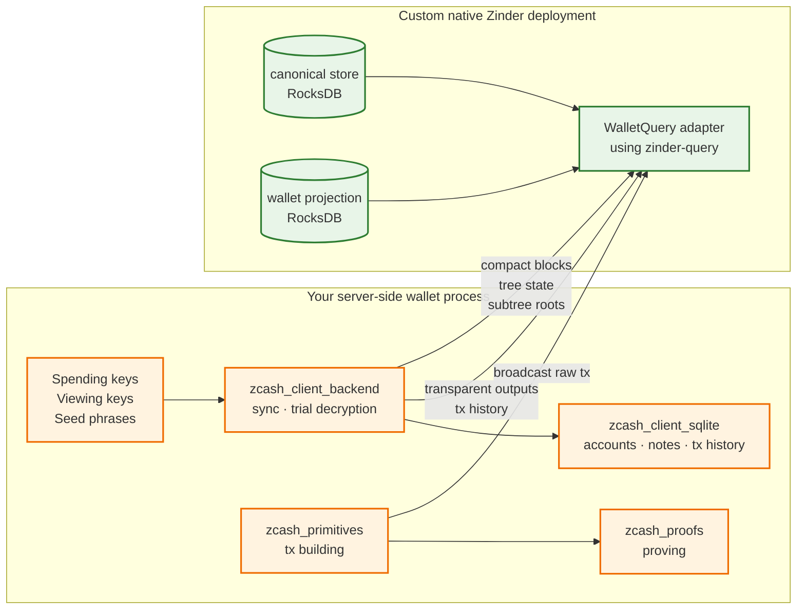

# Server-side wallet pattern on Zinder

This page describes the direct librustzcash pattern for a server-side wallet
that reads chain data from a deployment that embeds Zinder's native
`WalletQuery` adapter. It is an implementation reference, not a guide for
choosing an indexer. The native adapter is not one of the release runtimes. See
[Integration surfaces](integration-surfaces.md) for that choice.

There are 2 implementation levels:

1. **Use a higher-level wallet library.** A library can expose its own wallet
   lifecycle while mapping chain reads, events, and broadcast onto Zinder.
   Zally's `ChainSource` and `Submitter` traits illustrate this seam.
2. **Integrate librustzcash directly.** Use this pattern when the application
   needs to own those policies or expose a different wallet abstraction. The
   application adapts Zinder artifacts to librustzcash scanning and persists
   wallet state itself.

## Higher-level wallet library seam

Zally's existing interfaces show how a server-side wallet can divide the work.
`ChainSource` needs settled and visible tips, compact blocks, tree state, subtree
roots, transaction status, transparent UTXOs, and chain events. `Submitter`
needs transaction broadcast. These methods map to `RemoteChainIndex` and
`EndpointBackedIndex`, while Zally remains responsible for its SQLite wallet
state, sync driver, transaction lifecycle, key sealing, and recovery policy.

That method set requires `RemoteChainIndex` because chain events and broadcast
are endpoint-backed operations. The remaining sections apply when implementing
the equivalent integration directly with librustzcash.

## Direct librustzcash components

| Component | Crate or service | What it owns |
| --- | --- | --- |
| Shielded sync state machine | [`zcash_client_backend`](https://crates.io/crates/zcash_client_backend) | Walking the chain, trial-decrypting compact outputs, advancing per-account notes |
| Wallet state + key storage | [`zcash_client_sqlite`](https://crates.io/crates/zcash_client_sqlite) | SQLite-backed accounts, addresses, notes, transactions |
| Transaction building | [`zcash_primitives`](https://crates.io/crates/zcash_primitives) | Constructing transactions, computing fees, signing |
| Sapling/Orchard proving | [`zcash_proofs`](https://crates.io/crates/zcash_proofs) | Zero-knowledge proof generation |
| Chain reads + broadcast | **Zinder** | Compact blocks, tree state, subtree roots, transparent outputs, mempool, broadcast |
| Upstream node | Zebra | Block production / consensus / mempool source |

Zinder tracks the workspace's pinned `librustzcash` release train. A direct
integration should pin `zcash_client_backend`, `zcash_client_sqlite`,
`zcash_primitives`, and `zcash_proofs` together. A higher-level wallet library
can own that coordination for applications using its API.

## Boundary contract



**Keys never cross the wire to Zinder.** Trial decryption, note management, transaction signing, and proof generation all happen inside the consumer process. Zinder receives only the raw transaction bytes at broadcast time; raw bytes are already in canonical encoded form and reveal no key material.

**Per-account state never lives in Zinder.** Account balances, transaction labels, address books, fiat-conversion rates, and notification settings stay in the consumer's SQLite database.

## Direct integration sequence

The structure is "snapshot once, subscribe forever, re-derive on hint" (see [Chain events §Address Filters](../architecture/chain-events.md#address-filters)).

1. **Snapshot phase**: read the current state for each tracked account using `WalletQuery.TransparentAddressUnspentOutputs` (transparent; the stream is always the complete unspent set at one pinned chain epoch) plus `WalletQuery.CompactBlocksInRange` + `WalletQuery.TreeState` (shielded, fed to `zcash_client_backend::scan_cached_blocks`).
2. **Subscribe phase**: open a `WalletQuery.ChainEvents` stream with the addresses you care about in `address_filter`. Each envelope tells you a chain epoch advanced (commit) or replaced (reorg); use the height range to re-derive the affected slice from `compact_block_at` and merge the result into `zcash_client_sqlite`.
3. **Broadcast phase**: build the transaction with `zcash_primitives::transaction::builder::Builder`, prove it with `zcash_proofs`, and post the raw bytes via `WalletQuery.BroadcastTransaction`.
4. **Cursor persistence**: store the bytes from the latest `ChainEventEnvelope.cursor` durably alongside your wallet state. On restart, replay strictly after that cursor.

## Two client traits

`zinder-client` splits the chain-index contract in two so the compiler tells you which calls a handle can serve:

- `ChainIndex` carries immutable network metadata plus canonical and wallet-projection reads. The public `RemoteChainIndex` implements this contract as a `WalletQuery` gRPC client.
- `EndpointBackedIndex` carries the reads that need a live ingest-control/broadcast endpoint: transaction broadcast, the chain-event stream, live-mempool snapshot/events/overlays, chain value-pools, and the wallet-plane server descriptor. Only `RemoteChainIndex` implements it.

A function that broadcasts or subscribes to chain events bounds its handle `T: ChainIndex + EndpointBackedIndex`; a function that only reads canonical state bounds it `T: ChainIndex`.

## Direct integration skeleton

The block below is a compiled doctest. It uses the real `zinder-client` connect and stream API; the consumer-side persistence is a small in-test stub so the example stays self-contained without pulling in `zcash_client_sqlite`.

```rust,no_run
use tokio_stream::StreamExt as _;
use zinder_client::{
    ChainEventCursor, ChainEventEnvelope, ChainEventStreamFamily, ChainIndex, EndpointBackedIndex,
    EventStreamStart, IndexerError, Network, RawTransactionBytes, RemoteChainIndex,
    RemoteOpenOptions, TransactionBroadcastOutcome, TransparentAddressScriptHash,
    TransparentAddressUnspentOutputsQuery,
};

// Stand-in for the consumer's zcash_client_sqlite-backed state.
struct WalletDb;
impl WalletDb {
    fn open(_path: &str) -> Self {
        Self
    }
    fn watched_script_hashes(&self) -> Vec<TransparentAddressScriptHash> {
        Vec::new()
    }
    fn load_last_chain_event_cursor(&self) -> Option<ChainEventCursor> {
        None
    }
    fn save_chain_event_cursor(&mut self, _cursor: &ChainEventCursor) {}
    fn absorb_transparent_output(&mut self, _output: &zinder_client::TransparentUnspentOutput) {}
    fn apply_chain_event(&mut self, _envelope: &ChainEventEnvelope) {}
}

async fn run_server_wallet(endpoint: String) -> Result<(), IndexerError> {
    // 1. Connect to Zinder. `connect` is synchronous and only parses the URI;
    //    the channel dials lazily on the first call.
    let zinder = RemoteChainIndex::connect(RemoteOpenOptions {
        endpoint,
        network: Network::ZcashMainnet,
    })?;

    let mut wallet = WalletDb::open("wallet.sqlite");

    // 2. Snapshot: drain the complete unspent set for every watched address.
    //    `transparent_address_unspent_outputs` is a base `ChainIndex` read.
    for address_script_hash in wallet.watched_script_hashes() {
        let mut unspent_outputs = zinder
            .transparent_address_unspent_outputs(TransparentAddressUnspentOutputsQuery {
                address_script_hash,
                start_height: zinder_client::BlockHeight::new(0),
                at_epoch_id: None,
            })
            .await?;
        while let Some(unspent) = unspent_outputs.next().await {
            wallet.absorb_transparent_output(&unspent?.output);
        }
    }

    // 3. Snapshot shielded state with `compact_blocks_in_range` + `tree_state_at`
    //    (also base `ChainIndex` reads), fed to
    //    `zcash_client_backend::scan_cached_blocks`. Persist the note set.

    // 4. Subscribe forever. `chain_events_for_family` needs a live endpoint, so
    //    it is an `EndpointBackedIndex` method: a handle without an endpoint
    //    would not compile here. A persisted cursor resumes strictly after the
    //    last applied event; a fresh wallet replays the retention window.
    let start = wallet
        .load_last_chain_event_cursor()
        .map_or(EventStreamStart::EarliestRetained, EventStreamStart::AfterCursor);
    let mut stream = zinder
        .chain_events_for_family(start, ChainEventStreamFamily::Visible)
        .await?;
    while let Some(envelope) = stream.next().await {
        let envelope = envelope?;
        // Apply the event idempotently, then persist the cursor. A crash between
        // these operations replays the event instead of skipping its effects.
        wallet.apply_chain_event(&envelope);
        wallet.save_chain_event_cursor(&envelope.cursor);
    }
    Ok(())
}

// Broadcasting a transparent transaction needs an endpoint, so the bound is
// `ChainIndex + EndpointBackedIndex`.
async fn send_transparent<T: ChainIndex + EndpointBackedIndex>(
    zinder: &T,
    raw_transaction: RawTransactionBytes,
) -> Result<TransactionBroadcastOutcome, IndexerError> {
    zinder.broadcast_transaction(raw_transaction).await
}
```

## Error handling

Every `zinder-client` call returns `Result<_, IndexerError>`. The typed `IndexerError::reason()` and `IndexerError::retry_policy()` accessors give you a deterministic decision rule:

```rust,no_run
use zinder_client::{IndexerError, RetryPolicy};

fn classify<T>(outcome: Result<T, IndexerError>) -> Option<T> {
    match outcome {
        Err(error) => {
            match error.retry_policy() {
                RetryPolicy::RetryWithBackoff => { /* sleep, then retry */ }
                RetryPolicy::RefreshChainEpoch => { /* reacquire current_epoch and restart */ }
                RetryPolicy::OperatorActionRequired => { /* page on-call */ }
                RetryPolicy::ClientError => { /* fix the request, do not retry */ }
                // RetryPolicy is non_exhaustive; treat unknown policies as a
                // client error and surface them to the operator.
                _ => { /* fail closed */ }
            }
            None
        }
        Ok(ready) => Some(ready),
    }
}
```

See [Error vocabulary](error-vocabulary.md) for the per-reason table.

## What a direct integration still owns

A higher-level wallet library can implement these concerns. A direct
librustzcash integration leaves them to the consumer:

- **Key management.** Hardware-backed keystore vs. encrypted-on-disk is your call.
- **Account model.** One-account-per-customer vs. shared-omnibus is your call.
- **Per-customer notification.** Zinder gives you the invalidation hint; you
  wire the email, webhook, or push notification.
- **Fee policy.** Pick a fee strategy in `zcash_primitives::transaction::fees`.
- **Reorg recovery semantics.** When Zinder emits a `ChainReorged`, your wallet must reconcile the reverted range; `zcash_client_backend` has utilities for this, but the consumer applies them.

## When not to integrate librustzcash directly

- **You want a higher-level server-side wallet abstraction:** use a wallet
  library rather than rebuilding its lifecycle, storage, key sealing, sync, and
  recovery layers.
- **You only need transparent receives:** drop `zcash_client_backend` and
  `zcash_client_sqlite`, then integrate `zinder-client` directly against your
  own database.
- **You are building a light or mobile wallet:** keep the wallet SDK's
  `CompactTxStreamer` client and use `zinder-compat-lightwalletd`.
- **You are implementing a full-node wallet backend:** map its existing backend
  abstraction to the native `WalletQuery` protocol rather than linking this
  server-side wallet stack.

## References

- [ADR-0005: Consumer-neutral wallet data plane](../adrs/0005-consumer-neutral-wallet-data-plane.md)
- [Chain events §Address Filters](../architecture/chain-events.md#address-filters)
- [Indexer/wallet boundary](../architecture/indexer-wallet-boundary.md)
- [Wallet data plane](../architecture/wallet-data-plane.md)
- [Integration surfaces](integration-surfaces.md)
- [Error vocabulary](error-vocabulary.md)
