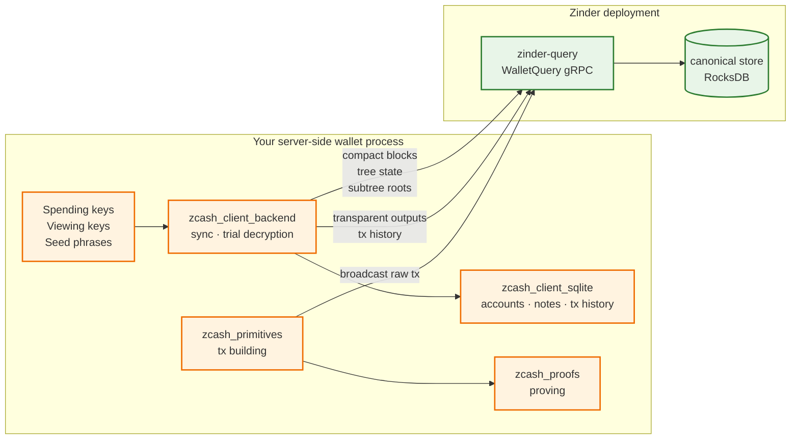

# Server-side Wallet Pattern on Zinder

This page is the canonical recipe for building a server-side Zcash wallet on top of Zinder. It names every component, points at the right librustzcash crate, and shows where the boundary between Zinder and the wallet lives. If you are building a faucet, an exchange backend, a custody service, or any other server-side wallet that wants Zinder's chain reads + broadcast without re-implementing transparent/shielded scanning, start here.

## Components

| Component | Crate or service | What it owns |
| --- | --- | --- |
| Shielded sync state machine | [`zcash_client_backend`](https://crates.io/crates/zcash_client_backend) | Walking the chain, trial-decrypting compact outputs, advancing per-account notes |
| Wallet state + key storage | [`zcash_client_sqlite`](https://crates.io/crates/zcash_client_sqlite) | SQLite-backed accounts, addresses, notes, transactions |
| Transaction building | [`zcash_primitives`](https://crates.io/crates/zcash_primitives) | Constructing transactions, computing fees, signing |
| Sapling/Orchard proving | [`zcash_proofs`](https://crates.io/crates/zcash_proofs) | Zero-knowledge proof generation |
| Chain reads + broadcast | **Zinder** | Compact blocks, tree state, subtree roots, transparent outputs, mempool, broadcast |
| Upstream node | Zebra | Block production / consensus / mempool source |

Zinder tracks the workspace's pinned `librustzcash` release train. Server-side
wallets should pin `zcash_client_backend`, `zcash_client_sqlite`,
`zcash_primitives`, and `zcash_proofs` together.

## Boundary contract



**Keys never cross the wire to Zinder.** Trial decryption, note management, transaction signing, and proof generation all happen inside the consumer process. Zinder receives only the raw transaction bytes at broadcast time; raw bytes are already in canonical encoded form and reveal no key material.

**Per-account state never lives in Zinder.** Account balances, transaction labels, address books, fiat-conversion rates, and notification settings stay in the consumer's SQLite database.

## Canonical pattern

The structure is "snapshot once, subscribe forever, re-derive on hint" (see [Chain events §Address Filters](../architecture/chain-events.md#address-filters)).

1. **Snapshot phase**: read the current state for each tracked account using `WalletQuery.TransparentAddressUnspentOutputs` (transparent; the stream is always the complete unspent set at one pinned chain epoch) plus `WalletQuery.CompactBlocksInRange` + `WalletQuery.TreeState` (shielded, fed to `zcash_client_backend::scan_cached_blocks`).
2. **Subscribe phase**: open a `WalletQuery.ChainEvents` stream with the addresses you care about in `address_filter`. Each envelope tells you a chain epoch advanced (commit) or replaced (reorg); use the height range to re-derive the affected slice from `compact_block_at` and merge the result into `zcash_client_sqlite`.
3. **Broadcast phase**: build the transaction with `zcash_primitives::transaction::builder::Builder`, prove it with `zcash_proofs`, and post the raw bytes via `WalletQuery.BroadcastTransaction`.
4. **Cursor persistence**: store the bytes from the latest `ChainEventEnvelope.cursor` durably alongside your wallet state. On restart, replay strictly after that cursor.

## Two client traits

`zinder-client` splits the chain-index contract in two so the compiler tells you which calls a handle can serve:

- `ChainIndex` carries the canonical and derive-store reads. Both `RemoteChainIndex` (a `WalletQuery` gRPC client) and `LocalChainIndex` (a colocated RocksDB-secondary reader) implement it identically: compact blocks, tree state, subtree roots, transparent-address unspent outputs and tx-history, canonical prevout resolution, and the confirmed transparent-address balance.
- `EndpointBackedIndex` carries the reads that need a live ingest-control/broadcast endpoint: transaction broadcast, the chain-event stream, live-mempool snapshot/events/overlays, chain value-pools, and the wallet-plane server descriptor. Only `RemoteChainIndex` implements it.

A function that broadcasts or subscribes to chain events bounds its handle `T: ChainIndex + EndpointBackedIndex`; a function that only reads canonical state bounds it `T: ChainIndex`. A `LocalChainIndex` passed where `EndpointBackedIndex` is required fails to compile, so the missing-endpoint case is a build error rather than a runtime error.

## Worked skeleton

The block below is a compiled doctest. It uses the real `zinder-client` connect and stream API; the consumer-side persistence is a small in-test stub so the example stays self-contained without pulling in `zcash_client_sqlite`.

```rust,no_run
use tokio_stream::StreamExt as _;
use zinder_client::{
    ChainEventCursor, ChainEventEnvelope, ChainEventStreamFamily, ChainIndex, EndpointBackedIndex,
    IndexerError, Network, RawTransactionBytes, RemoteChainIndex, RemoteOpenOptions,
    TransactionBroadcastResult, TransparentAddressScriptHash,
    TransparentAddressUnspentOutputsQuery,
};

// Stand-in for the consumer's zcash_client_sqlite-backed state.
struct WalletDb;
impl WalletDb {
    fn open(_path: &str) -> Self {
        Self
    }
    fn watched_script_hashes(&self) -> Vec<TransparentAddressScriptHash> {
        Vec::new()
    }
    fn load_last_chain_event_cursor(&self) -> Option<ChainEventCursor> {
        None
    }
    fn save_chain_event_cursor(&mut self, _cursor: &ChainEventCursor) {}
    fn absorb_transparent_output(&mut self, _output: &zinder_client::TransparentUnspentOutput) {}
    fn apply_chain_event(&mut self, _envelope: &ChainEventEnvelope) {}
}

async fn run_server_wallet(endpoint: String) -> Result<(), IndexerError> {
    // 1. Connect to Zinder. `connect` is synchronous and only parses the URI;
    //    the channel dials lazily on the first call.
    let zinder = RemoteChainIndex::connect(RemoteOpenOptions {
        endpoint,
        network: Network::ZcashMainnet,
    })?;

    let mut wallet = WalletDb::open("wallet.sqlite");

    // 2. Snapshot: drain the complete unspent set for every watched address.
    //    `transparent_address_unspent_outputs` is a base `ChainIndex` read, so
    //    a colocated `LocalChainIndex` could serve it too.
    for address_script_hash in wallet.watched_script_hashes() {
        let mut unspent_outputs = zinder
            .transparent_address_unspent_outputs(TransparentAddressUnspentOutputsQuery {
                address_script_hash,
                start_height: zinder_client::BlockHeight::new(0),
            })
            .await?;
        while let Some(unspent) = unspent_outputs.next().await {
            wallet.absorb_transparent_output(&unspent?.output);
        }
    }

    // 3. Snapshot shielded state with `compact_blocks_in_range` + `tree_state_at`
    //    (also base `ChainIndex` reads), fed to
    //    `zcash_client_backend::scan_cached_blocks`. Persist the note set.

    // 4. Subscribe forever. `chain_events_for_family` needs a live endpoint, so
    //    it is an `EndpointBackedIndex` method: a handle without an endpoint
    //    would not compile here.
    let mut stream = zinder
        .chain_events_for_family(wallet.load_last_chain_event_cursor(), ChainEventStreamFamily::Tip)
        .await?;
    while let Some(envelope) = stream.next().await {
        let envelope = envelope?;
        // Persist the cursor before applying the event so a crash resumes from
        // the next event after the last fully-applied one.
        wallet.save_chain_event_cursor(&envelope.cursor);
        wallet.apply_chain_event(&envelope);
    }
    Ok(())
}

// Broadcasting a transparent transaction needs an endpoint, so the bound is
// `ChainIndex + EndpointBackedIndex`.
async fn send_transparent<T: ChainIndex + EndpointBackedIndex>(
    zinder: &T,
    raw_transaction: RawTransactionBytes,
) -> Result<TransactionBroadcastResult, IndexerError> {
    zinder.broadcast_transaction(raw_transaction).await
}
```

## Error handling

Every `zinder-client` call returns `Result<_, IndexerError>`. The typed `IndexerError::reason()` and `IndexerError::retry_policy()` accessors give you a deterministic decision rule:

```rust,no_run
use zinder_client::{IndexerError, RetryPolicy};

fn classify<T>(outcome: Result<T, IndexerError>) -> Option<T> {
    match outcome {
        Err(error) => {
            match error.retry_policy() {
                RetryPolicy::RetryWithBackoff => { /* sleep, then retry */ }
                RetryPolicy::OperatorActionRequired => { /* page on-call */ }
                RetryPolicy::ClientError => { /* fix the request, do not retry */ }
                // RetryPolicy is non_exhaustive; treat unknown policies as a
                // client error and surface them to the operator.
                _ => { /* fail closed */ }
            }
            None
        }
        Ok(ready) => Some(ready),
    }
}
```

See [Error vocabulary](error-vocabulary.md) for the per-reason table.

## What you still need to write yourself

This pattern leaves these pieces to the consumer:

- **Key management.** Hardware-backed keystore vs. encrypted-on-disk is your call.
- **Account model.** One-account-per-customer vs. shared-omnibus is your call.
- **Per-customer notification.** Email, webhook, push notification — Zinder gives you the invalidation hint; you wire the alert.
- **Fee policy.** Pick a fee strategy in `zcash_primitives::transaction::fees`.
- **Reorg recovery semantics.** When Zinder emits a `ChainReorged`, your wallet must reconcile the reverted range; `zcash_client_backend` has utilities for this, but the consumer applies them.

## When NOT to use this pattern

- **You only need transparent receives** (no shielded support): drop `zcash_client_backend`/`zcash_client_sqlite` and integrate `zinder-client` directly against your own database.
- **You are building a mobile app**: use the Zashi/Zodl SDK or `zinder-compat-lightwalletd` rather than directly integrating `zcash_client_backend`. Mobile constraints (battery, network) shape the integration enough that a dedicated SDK is the right path.
- **You are building a desktop wallet**: consider Zallet directly. It is the full-node wallet process that already pairs with Zinder.

## References

- [ADR-0005: Consumer-neutral wallet data plane](../adrs/0005-consumer-neutral-wallet-data-plane.md)
- [Chain events §Address Filters](../architecture/chain-events.md#address-filters)
- [Indexer/wallet boundary](../architecture/indexer-wallet-boundary.md)
- [Wallet data plane](../architecture/wallet-data-plane.md)
- [Integration surfaces](integration-surfaces.md)
- [Error vocabulary](error-vocabulary.md)
