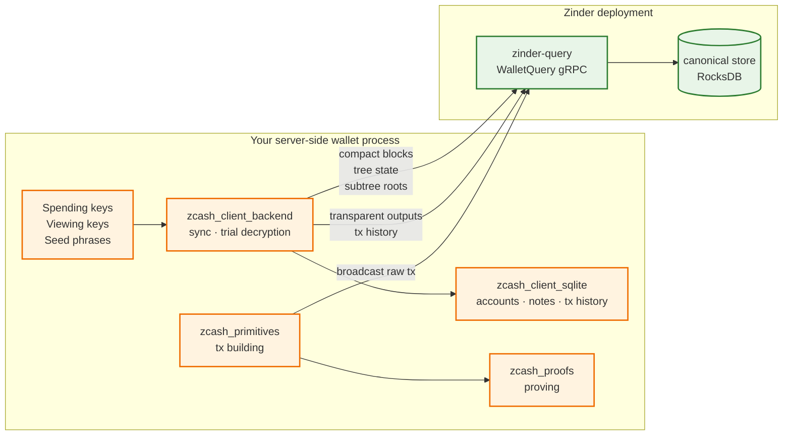

# Server-side Wallet Pattern on Zinder

This page is the canonical recipe for building a server-side Zcash wallet on top of Zinder. It names every component, points at the right librustzcash crate, and shows where the boundary between Zinder and the wallet lives. If you are building a faucet, an exchange backend, a custody service, or any other server-side wallet that wants Zinder's chain reads + broadcast without re-implementing transparent/shielded scanning, start here.

## Components

| Component | Crate or service | What it owns |
| --- | --- | --- |
| Shielded sync state machine | [`zcash_client_backend`](https://crates.io/crates/zcash_client_backend) | Walking the chain, trial-decrypting compact outputs, advancing per-account notes |
| Wallet state + key storage | [`zcash_client_sqlite`](https://crates.io/crates/zcash_client_sqlite) | SQLite-backed accounts, addresses, notes, transactions |
| Transaction building | [`zcash_primitives`](https://crates.io/crates/zcash_primitives) | Constructing transactions, computing fees, signing |
| Sapling/Orchard proving | [`zcash_proofs`](https://crates.io/crates/zcash_proofs) | Zero-knowledge proof generation |
| Chain reads + broadcast | **Zinder** | Compact blocks, tree state, subtree roots, transparent outputs, mempool, broadcast |
| Upstream node | Zebra | Block production / consensus / mempool source |

Zinder tracks the workspace's pinned `librustzcash` release train. Server-side
wallets should pin `zcash_client_backend`, `zcash_client_sqlite`,
`zcash_primitives`, and `zcash_proofs` together.

## Boundary contract



**Keys never cross the wire to Zinder.** Trial decryption, note management, transaction signing, and proof generation all happen inside the consumer process. Zinder receives only the raw transaction bytes at broadcast time; raw bytes are already in canonical encoded form and reveal no key material.

**Per-account state never lives in Zinder.** Account balances, transaction labels, address books, fiat-conversion rates, and notification settings stay in the consumer's SQLite database.

## Canonical pattern

The structure is "snapshot once, subscribe forever, re-derive on hint" (see [Chain events §Address Filters](../architecture/chain-events.md#address-filters)).

1. **Snapshot phase**: read the current state for each tracked account using `WalletQuery.TransparentAddressUnspentOutputs` (transparent; the stream is always the complete unspent set at one pinned chain epoch) plus `WalletQuery.CompactBlockRange` + `WalletQuery.TreeState` (shielded, fed to `zcash_client_backend::scan_cached_blocks`).
2. **Subscribe phase**: open a `WalletQuery.ChainEvents` stream with the addresses you care about in `address_filter`. Each envelope tells you a chain epoch advanced (commit) or replaced (reorg); use the height range to re-derive the affected slice from `compact_block_at` and merge the result into `zcash_client_sqlite`.
3. **Broadcast phase**: build the transaction with `zcash_primitives::transaction::builder::Builder`, prove it with `zcash_proofs`, and post the raw bytes via `WalletQuery.BroadcastTransaction`.
4. **Cursor persistence**: store the bytes from the latest `ChainEventEnvelope.cursor` durably alongside your wallet state. On restart, replay strictly after that cursor.

## Worked skeleton

The code below uses pseudocode for the consumer-side crates and the real `zinder-client::ChainIndex` trait for the chain-read calls. It demonstrates the shape; it is not a complete wallet.

```rust
use std::time::Duration;
use zinder_client::{
    ChainEventStreamFamily, ChainIndex, RemoteChainIndex, RemoteOpenOptions,
};

async fn run_server_wallet(
    endpoint: String,
    watched_addresses: Vec<String>,
) -> Result<(), Box<dyn std::error::Error>> {
    // 1. Connect to Zinder.
    let zinder = RemoteChainIndex::connect(
        RemoteOpenOptions::new(endpoint).request_timeout(Duration::from_secs(30)),
    )
    .await?;

    // 2. Persist the wallet state in zcash_client_sqlite. (Pseudocode.)
    let mut wallet = open_wallet_db("wallet.sqlite")?;

    // 3. Snapshot: drain the complete unspent set for every watched address.
    for address in &watched_addresses {
        let mut unspent_outputs = zinder
            .transparent_address_unspent_outputs(transparent_address_query(address))
            .await?;
        while let Some(unspent) = unspent_outputs.next().await {
            wallet.absorb_transparent_output(&unspent?.output)?;
        }
    }

    // 4. Snapshot: walk compact blocks + tree state for shielded sync.
    //    (zcash_client_backend::scan_cached_blocks fed by `compact_blocks_in_range`)
    //    Persist the resulting note set into wallet.

    // 5. Subscribe forever with the address filter.
    let cursor = wallet.load_last_chain_event_cursor()?;
    let mut stream = zinder
        .chain_events_for_family(cursor, ChainEventStreamFamily::Tip)
        .await?;
    while let Some(envelope) = stream.recv().await? {
        // Persist the cursor BEFORE applying the event so a crash resumes from
        // the next event after the last fully-applied one.
        wallet.save_chain_event_cursor(&envelope.cursor)?;
        wallet.apply_chain_event(&envelope, &zinder).await?;
    }
    Ok(())
}

// Building and broadcasting a transparent transaction:
async fn send_transparent(
    zinder: &impl ChainIndex,
    raw_transaction: zinder_client::RawTransactionBytes,
) -> Result<(), Box<dyn std::error::Error>> {
    let result = zinder.broadcast_transaction(raw_transaction).await?;
    println!("broadcast result: {result:?}");
    Ok(())
}
```

## Error handling

Every `zinder-client` call returns `Result<_, IndexerError>`. The typed `IndexerError::reason()` and `IndexerError::retry_policy()` accessors give you a deterministic decision rule:

```rust
use zinder_client::{IndexerError, RetryPolicy};

match wallet_call_result {
    Err(error) => match error.retry_policy() {
        RetryPolicy::RetryWithBackoff => /* sleep, then retry */,
        RetryPolicy::OperatorActionRequired => /* page on-call */,
        RetryPolicy::ClientError => /* fix the request, do not retry */,
    },
    Ok(value) => /* use value */,
}
```

See [Error vocabulary](error-vocabulary.md) for the per-reason table.

## What you still need to write yourself

This pattern leaves these pieces to the consumer:

- **Key management.** Hardware-backed keystore vs. encrypted-on-disk is your call.
- **Account model.** One-account-per-customer vs. shared-omnibus is your call.
- **Per-customer notification.** Email, webhook, push notification — Zinder gives you the invalidation hint; you wire the alert.
- **Fee policy.** Pick a fee strategy in `zcash_primitives::transaction::fees`.
- **Reorg recovery semantics.** When Zinder emits a `ChainReorged`, your wallet must reconcile the reverted range; `zcash_client_backend` has utilities for this, but the consumer applies them.

## When NOT to use this pattern

- **You only need transparent receives** (no shielded support): drop `zcash_client_backend`/`zcash_client_sqlite` and integrate `zinder-client` directly against your own database.
- **You are building a mobile app**: use the Zashi/Zodl SDK or `zinder-compat-lightwalletd` rather than directly integrating `zcash_client_backend`. Mobile constraints (battery, network) shape the integration enough that a dedicated SDK is the right path.
- **You are building a desktop wallet**: consider Zallet directly. It is the full-node wallet process that already pairs with Zinder.

## References

- [ADR-0005: Consumer-neutral wallet data plane](../adrs/0005-consumer-neutral-wallet-data-plane.md)
- [Chain events §Address Filters](../architecture/chain-events.md#address-filters)
- [Indexer/wallet boundary](../architecture/indexer-wallet-boundary.md)
- [Wallet data plane](../architecture/wallet-data-plane.md)
- [Integration surfaces](integration-surfaces.md)
- [Error vocabulary](error-vocabulary.md)
